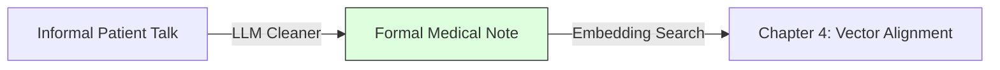

# 5.1. LLM Clinical Cleaner Logic

Before we perform any vector math, our architecture uses a Large Language Model (Gemini/GPT) as a **Clinical Translator.** This step is mandatory because patients do not speak in standardized medical codes.

## 1. The Raw Input Problem
Patient notes are often informal and "fuzzy."
- **Raw Note**: *"Kid has shaky eyes and white eyelashes. His skin is very pale."*
- **The Issue**: If you feed this directly to BioBERT, the model has to deal with "Noise" (Kid, has, and, his).

## 2. The LLM Cleaner: Translating to "Truth"
Our architecture sends the raw note to an LLM with a specific medical prompt. 
- **LLM Output**: *"Patient exhibits **nystagmus**, **oculocutaneous hypopigmentation**, and **leukotrichia**."*
- **Mathematical Shift**: As discussed in Chapter 4, this standardization raises the similarity score from a "fuzzy" 0.7 up to a "rigorous" 0.95.

## 3. Why this works with BioBERT
Standardizing the vocabulary aligns the patient note with the **Orphanet/HPO Dictionaries.** 
- BioBERT doesn't have to "guess" anymore.
- It sees terms like "Nystagmus" in the note and "Nystagmus" in the Orphanet definition. 
- The resulting vectors point in the **exact same clinical direction**, maximizing the Cosine Similarity.

---

## Reminders for the Jury
- **No Hallucination**: If a jury asks about AI hallucinations, explain that the LLM is only used for **Syntactic Cleaning**, not for diagnosis. The diagnosis is controlled by the **Knowledge Graph** later in the pipeline.
- **Precision vs Recall**: The LLM Cleaner is what drives our **High Recall** in Phase 1 (Retrieval).

