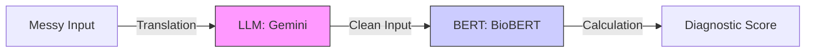

# 4.1. LLM Architecture vs. BERT

To understand why your project uses two different types of AI, you must understand the difference between an **Encoder** and a **Decoder.**

## 1. BERT: The Bidirectional Encoder
BERT is designed to **compress** information.
- **The Process**: It reads the whole sentence (left and right) and collapses it into a single 768-D vector.
- **The Result**: A mathematical "Summary" of the meaning.
- **Project Role**: The **Scorer.** It compares two summarized meanings to see if they match.

## 2. LLMs: The Autoregressive Decoder (Gemini)
Gemini and ChatGPT are designed to **expand** or **transform** information.
- **The Process**: They predict the next word in a sequence based on a prompt.
- **The Result**: New human-readable text.
- **Project Role**: The **Translator.** It transforms messy patient language into clean, scientific language.

---

## 3. The Hybrid Rationale: Why not just use one?

### Why not just BERT?
BERT is "silent." It can't explain anything. It can't take a patient's story and "re-write" it. It can only turn it into numbers. 

### 3.1. The NER Paradigm Shift
Before LLMs, extracting entities like Genes or Proteins required "Training" a dedicated **Named Entity Recognition (NER)** model (using tools like spaCy). This required thousands of manually labeled examples: `[OCA1](GENE) causes [Albinism](SYMPTOM)`.

**The Gemini Advantage**: Because Gemini has already "read" the internet (including PubMed), it already knows what a gene is. By using a strict JSON prompt, you turned a chatbot into a high-precision medical extractor without needing to train a new model. This is what your supervisor meant by *"here LLMs are easier."*

### Why not just the LLM?
LLMs are "Probabilistic." If you ask Gemini if two diseases are similar, it might say "Yes" one day and "No" the next because it is predicting the most likely word, not calculating a fixed biological truth. 

**The Winning Strategy**:
1.  Use the **LLM** (The human-like brain) to understand and clean the patient's note.
2.  Use **BioBERT** (The robotic mathematician) to calculate a fixed, reproducible similarity score.

## Reminders for your Presentation
- **Complementary Intelligence**: This is the phrase to use. The LLM handles the "Natural Language" and BERT handles the "Mathematical Representation."
- **Compute Efficiency**: It is much faster to run a small BERT model for 10,000 similarity checks than to ask a massive LLM to compare 10,000 pairs of text.

