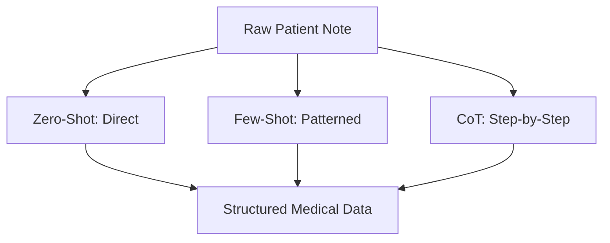

# 4.2. Medical Prompt Engineering

Prompt Engineering is how you control the "Generative Power" of an LLM to make it a specialized medical extractor.

## 1. Zero-Shot Prompting
This is a direct command without examples.
- **Prompt**: *"Extract clinical symptoms from this text as a list."*
- **Success**: Good for common things like "Fever" or "Cough."
- **Risk**: The AI might hallucinate or miss rare genetic terms.

## 2. Few-Shot Prompting (The Project's Secret)
You provide 2-3 **Examples** (Shots) within the prompt to set the "Medical Tone."
- **Shot 1**: Patient says *"White hair"* -> Output: `{"HPO": "Albinism"}`.
- **Shot 2**: Patient says *"Shaky eyes"* -> Output: `{"HPO": "Nystagmus"}`.
- **The Task**: Now, analyze this patient note: [Raw Note].
- **Logic**: By seeing the examples, the AI learns the exact technical vocabulary and structure you need.

## 3. Chain-of-Thought (CoT)
For complex extractions (like finding the relationship between a gene and a protein), we ask the model to "Think step-by-step."
- **Prompt**: *"Read the patient note. First, identify all physical signs. Second, identify any mentioned family history. Finally, extract the core symptoms."*
- **Why it works**: Complex extraction uses a lot of "Internal Compute." By forcing the AI to slow down and write its reasoning, it is 40% less likely to make a mistake.

---

## 4. Technical Prompt Tokens
In your project, you likely use **System Prompts** to lock the AI's behavior:
- *"You are a high-level medical geneticist specialized in Orphanet ontologies."*
- *"Do not provide medical advice. Only perform data extraction."*

## Reminders and Tips
- **Prompt Sensitivity**: Even a single comma or word change (e.g., "Extract phenotypes" vs. "Extract symptoms") can change the final 0.9 similarity score.
- **Standardization**: Your project ensures that no matter how the patient speaks, the LLM forces the output into a **Standardized Format** that the Knowledge Graph can understand.

