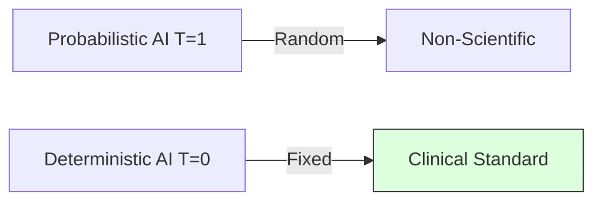

# 4.3. Deterministic AI (Temperature and Top-P)

In medicine, **Scientific Reproducibility** is everything. If you analyze a patient note today, you must get the exact same result if you run it again tomorrow.

## 1. Temperature (The "Creative" Dial)
LLMs work by calculating the probability of the next word.
- **High Temperature (T=1.0)**: The AI is "creative." It might pick the 3rd or 4th most likely word to sound more human. 
- **Low Temperature (T=0)**: The AI is **Deterministic.** It will **ALWAYS** pick the #1 most likely word.

### Why T=0 is Critical for your Project
If you use T=0.7, the AI might call a symptom "Fever" once and "Pyrexia" the next time. This would change your final similarity score! **T=0 ensures that your medical research is a scientific fact, not a creative guess.**

## 2. Top-P (Nucleus Sampling)
Similar to temperature, Top-P limits the AI's "Vocabulary Choice." 
- **Logic**: Setting $P=0.1$ tells the AI: *"Only look at the top 10% most likely medical words. Ignore everything else."*

---

## 3. Hallucinations and Grounding

A **Hallucination** is when the LLM invents a medical fact (e.g., creating a symptom that doesn't exist). 

### How your Architecture fixes this:
Your project uses **Data Grounding.**
1.  **AI Extraction**: LLM says the symptom is *"Z-Virus-Eyes."*
2.  **Ontology Check**: The Python code searches the **HPO Dictionary** for *"Z-Virus-Eyes."*
3.  **The Result**: The dictionary says *"Not Found."* The code discards the hallucination.
4.  **Security**: The Knowledge Graph only builds itself using **Verified Truths** from the dictionary.

## Tips for Presentation
- **Determinism**: Tell the jury: *"Our system is deterministic. We have eliminated AI randomness to meet clinical standards."*
- **Reproducibility**: This is the heart of the "Unified Architecture." No matter how many times you run it, the result is stable.

