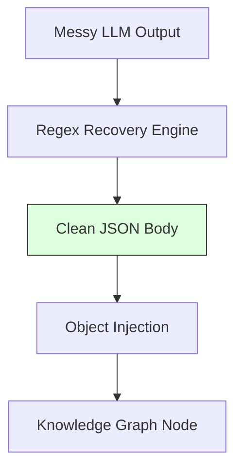

# 4.4. Regex Recovery and JSON Structuring

Even with perfect prompting, LLMs sometimes ignore instructions. This note explains the **"Safety Net"** in your Python code.

## 1. The "Chatty AI" Problem
You prompt: *"Extract JSON only."*
The AI responds: *"Certainly! Here is your data: ```json { "symptom": "Nystagmus" } ```"*
- **The Crash**: If your code tries `json.loads(response)`, it will crash because of the words *"Certainly! Here is your data."*

## 2. The Regex Solution
Your code uses a **Regular Expression (Regex)** to "scrape" the meaningful data out of the AI's chat.
- **Pattern**: `r'\{.*\}'`
- **Logic**:
  1.  `\{`: Find the first opening bracket.
  2.  `.*`: Capture every character inside (the data).
  3.  `\}`: Stop at the last closing bracket.
- **Benefit**: This makes your pipeline **Robust.** It doesn't matter if the AI is polite or rude; your system only sees the structured scientific data.

## 3. JSON Structuring: The Predicate Model
In your project, the extracted data is organized into a specific JSON schema:
```json
{
  "Symptoms": ["Nystagmus", "White Hair"],
  "Genes": ["OCA1"],
  "Proteins": ["Tyrosinase"]
}
```
### Why this structure?
This exact order matches the **RDF Predicates** we use in Chapter 6. 
- "Symptoms" becomes the edge `has_phenotype`.
- "Genes" becomes the edge `associated_gene`.
By forcing the AI to use these specific keys, the transition from "Text" to "Knowledge Graph" becomes automatic.

---

## Important Reminders
- **Scaling**: Emphasize that this Regex recovery allows you to process **Thousands of patient notes** without a human ever needing to "copy-paste" or "clean" the results.
- **Consistency**: Mention that your code lowercases and trims all extracted entities to ensure that "Nystagmus" and "nystagmus" are treated as the same node.


