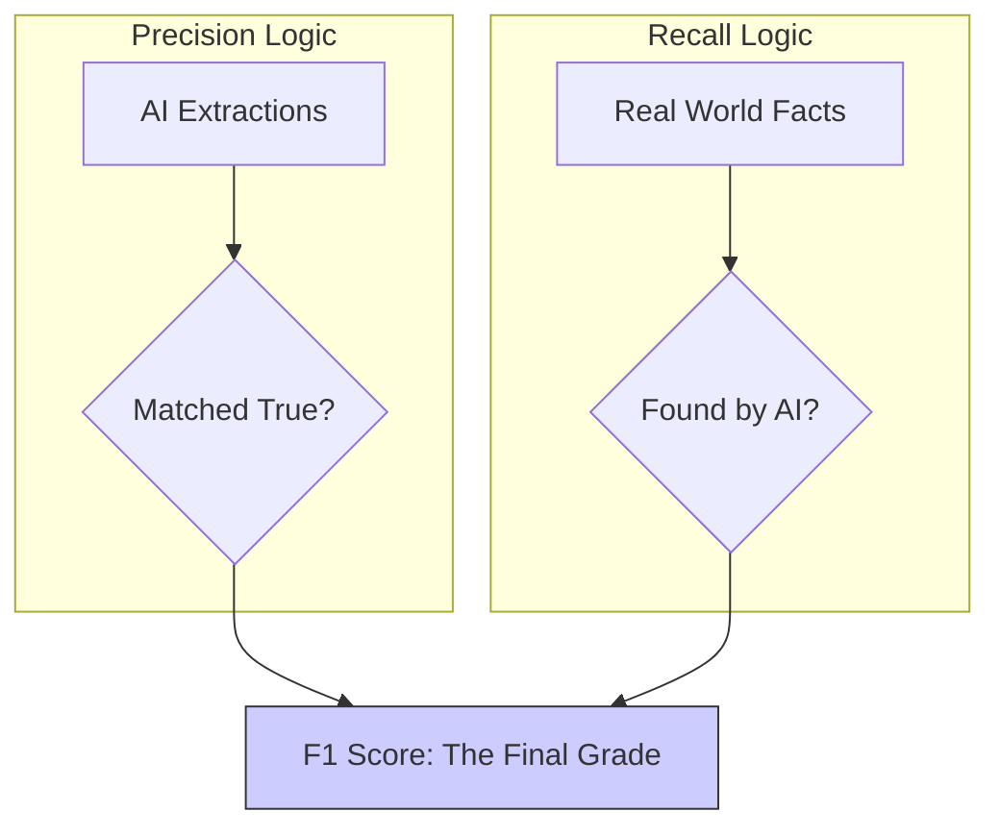

# 4.5. NER Evaluation Metrics (Precision, Recall, F1)

After the LLM extracts clinical signs from a note, we must measure its accuracy scientifically. We use the same metrics used in clinical trials: **Precision, Recall, and F1-Score.**

## 1. Precision (The Accuracy Metric)
**"Out of all the symptoms the AI claimed it found, how many were actually real symptoms?"**
$$ \text{Precision} = \frac{TP}{TP + FP} $$
- **TP (True Positive)**: AI found "Albinism," and the doctor agrees.
- **FP (False Positive)**: AI found "Hospital" as a symptom. (Incorrect extraction).

## 2. Recall (The Completeness Metric)
**"Out of all the symptoms mentioned in the doctor's note, how many did the AI successfully find?"**
$$ \text{Recall} = \frac{TP}{TP + FN} $$
- **TP (True Positive)**: AI found "Fever," and it was indeed in the note.
- **FN (False Negative)**: The note mentioned "Fever," but the AI ignored it. (Missing data).

## 3. The F1-Score (The Harmonic Mean)
The F1-Score is the "Grand Total" that balances both. It ensures the AI isn't just "guessing everything" or "being too shy."
$$ F1 = 2 \times \frac{\text{Precision} \times \text{Recall}}{\text{Precision} + \text{Recall}} $$

---

## 4. Clinical Logic: Why Recall is King
In most AI projects (like spam filters), we want high Precision (don't block good emails). But in **Rare Disease Medicine**, we prioritize **RECALL**.

### The "Diagnostic Stakes" Scenario:
- **Scenario A (Low Precision)**: AI suggest 10 extra symptoms that aren't there. A doctor can quickly discard them in 30 seconds.
- **Scenario B (Low Recall)**: AI misses the **one** specific protein marker that identifies a deadly genetic mutation. The patient remains undiagnosed for years.
- **Conclusion**: It is far better to have a "Noisy" AI that finds too much than a "Silent" AI that misses a life-saving clue.

## Tips for Presentation
- **Ground Truth**: Explain that to calculate these, you compared the LLM's output against a **Doctor's Manual Labeling** (The Gold Standard).
- **Sensitivity**: Recall is often called **Sensitivity** in hospitals. Use both terms to sound more professional.

