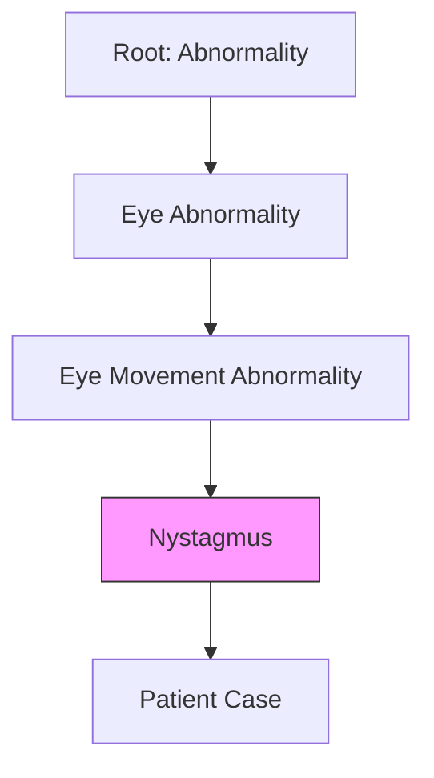

# 5.1. Taxonomy and Hierarchy in Medicine

## 1. The Need for Order
If a patient has a rare disease, they might describe their symptoms in a way that doesn't match any textbook. To solve this, medicine uses **Ontologies**—structured maps of human knowledge.

## 2. Taxonomy vs. Ontology
- **Taxonomy**: A simple classification (e.g., a tree of animals).
- **Ontology**: A complex web that defines both the entities (e.g., "The Eye") and the **Relationships** between them (e.g., "The Iris is **part of** the Eye").

## 3. The Logic of Clinical Inheritance ("Is-A")
The most powerful tool in an ontology is the **"Is-A" relationship.** This allows for **Clinical Reasoning.**

### The Family Tree:
1.  **Level 1**: Phenotypic Abnormality (Root node)
2.  **Level 2**: $\downarrow$ Abnormality of the Eye
3.  **Level 3**: $\downarrow$ Abnormal Eye Movement
4.  **Level 4**: $\downarrow$ **Nystagmus** (The specific symptom)

### Why this matters for the AI:
If your project's Knowledge Graph doesn't find a direct match for "Nystagmus," it can "Look Up" the tree. It sees that Nystagmus is an "Abnormal Eye Movement." It can then find other diseases that also feature eye movement abnormalities. This is how the AI **Genalizes** when it encounters a rare or unique case.

---

## 4. Graph Density
In your project, the more "Parents" and "Children" a node has, the more **Dense** that area of the Knowledge Graph becomes. Denser areas usually represent well-researched medical fields, while "Sparse" areas represent the frontiers of rare disease research.

## Reminders for your Presentation
- **Standardization**: Tell the jury: *"We don't just use a list of symptoms; we use a hierarchical ontology that understands the biological relationship between every term."*
- **Explainability**: This structure is what allows your AI to explain **WHY** it made a diagnosis—it can show the path up and down the medical family tree.

