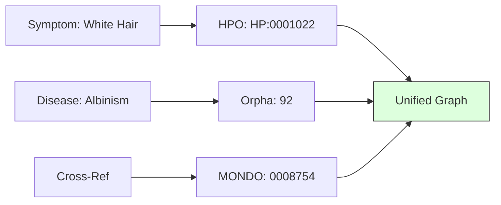

# 5.2. HPO, Orphanet, and MONDO ID Logic

While a human sees names like "Albinism," your Knowledge Graph sees **Permanent Identifiers (IDs).** This note explains the three main coding systems in your project.

## 1. HPO (Human Phenotype Ontology) $\rightarrow$ Symptoms
The HPO is the dictionary for **Symptoms (Phenotypes).**
- **Format**: `HP:XXXXXXX`
- **Example**: `HP:0001022` (Albinism / White hair).
- **Project Role**: Used to label the external clinical signs extracted by the LLM.

## 2. Orphanet $\rightarrow$ Rare Diseases
Orphanet is the global authority on **Rare Diseases.** 
- **Format**: `Orpha:XXXX`
- **Example**: `Orpha:92` (Oculocutaneous Albinism).
- **Project Role**: These IDs are the "Anchor Nodes" in your graph. They link symptoms, genes, and proteins together into one disease profile.

## 3. MONDO $\rightarrow$ The "Bridge"
MONDO is an "Ontology of Ontologies." It merges Orphanet with other massive systems like OMIM and ICD-10.
- **Example**: If a hospital uses ICD-10 code `E70.3`, MONDO knows it is the same as `Orpha:92`.
- **Project Role**: It makes your architecture **Interoperable.** You can import data from any hospital in the world, and MONDO will "translate" it into your unified graph structure.

---

## 4. Why use IDs instead of Words?
1.  **Global Language**: A doctor in Algeria writes *"Mélasse"*, a doctor in Japan writes in Kanji, but they both use **HP:0123**.
2.  **Uniqueness**: There are dozens of types of Albinism. Use of the ID ensures the AI is talking about the **exact** sub-type mentioned in the research.
3.  **Graph Math**: It is much faster for a computer to compare the number `92` than the string `"Oculocutaneous Albinism Type 1."`

## Tips for Presentation
- **Identifiers over Strings**: Tell the jury: *"Our system uses unique identifiers, making it immune to spelling mistakes or language barriers."*
- **Linked Open Data**: Mention that these IDs are part of the global **Semantic Web**, allowing your project to theoretically connect to any other medical database in real-time.

