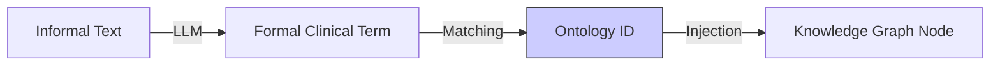

# 5.3. Semantic Normalization

This note explains the **"Bridge"** from messy text to a clean Knowledge Graph. This process is called **Semantic Normalization.**

## 1. The Semantic Gap
- **The Patient**: *"My eyes won't stop shaking when I look at things."*
- **The Medical Record**: *"Patient exhibits spontaneous nystagmus."*
- **The Ontology**: **HP:0000639** (Nystagmus).

The difference between these three levels is called the **Semantic Gap.** If your AI only looks for the word "Nystagmus," it will fail to help the patient who just says "shaking eyes."

## 2. Your Two-Stage Solution
Your "Unified Medical Knowledge Architecture" uses a two-stage bridge:

1.  **Stage 1: LLM Translation**: The Gemini AI reads the informal patient note and "re-writes" it using the formal vocabulary of the HPO dictionary.
2.  **Stage 2: Dictionary Matching**: The code then performs a perfect match between that formal clinical term and the **Unique ID** (`HP:0000639`).

## 3. Why this is superior to pure NLP
If you just used BioBERT (Method 1), you would get a "fuzzy" similarity score (e.g., 0.9). 
By adding **Normalization** (Method 2), you turn that fuzzy number into an **Absolute Link.**
- BioBERT says: *"This sounds like Nystagmus (0.91)."*
- Normalization says: *"This IS HP:0000639 (Confirmed)."*

---

## 4. Grounding the Knowledge Graph
Once a symptom is normalized to an ID, it is "Grounded." It can no longer change. It is now a **Hard Fact** that can be injected into the Knowledge Graph for final reasoning.

## Reminders for your Presentation
- **Data Integrity**: Explain that normalisation is the "Filter" that removes irrelevant noise from the patient note, keeping only the biological truths.
- **Interoperability**: Standardized IDs mean your graph can "talk" to other medical tools and databases.

