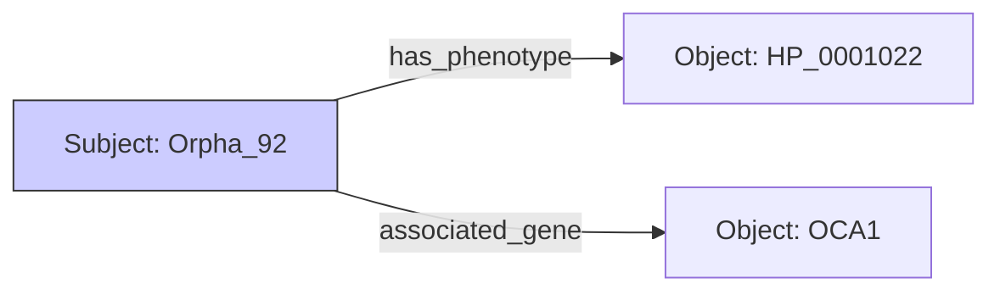

# 6.1. RDF SPO Model and Turtle Syntax

The final architecture of your project is an **RDF Knowledge Graph.** RDF (Resource Description Framework) is the global standard for representing knowledge on the Semantic Web.

## 1. The Atom of Knowledge: The Triplet (SPO)
Every medical fact is broken down into its smallest possible piece, called a **Triplet.**
1.  **Subject**: The entity you are talking about (e.g., Orpha:92 / Albinism).
2.  **Predicate**: The relationship or "verb" (e.g., `has_symptom`).
3.  **Object**: The value or target entity (e.g., HP:0001022 / While Hair).

### Why use Triplets?
In a standard database, information is trapped in cells. In a Triplet model, knowledge is an **"Infinite Web."** You can add a new fact (triplet) at any time without redesigning the whole database.

## 2. Turtle (.ttl) Notation
In your project, the triplets are represented in **Turtle syntax.** This is a shorthand way to write RDF that is easy for humans and computers.

```turtle
# Prefixes for shorthand
@prefix orpha: <http://www.orphanet.org/id/> .
@prefix hpo: <http://purl.obolibrary.org/obo/HP_> .
@prefix rdfs: <http://www.w3.org/2000/01/rdf-schema#> .

# Defining Oculocutaneous Albinism Type 1
orpha:92 rdfs:label "Albinism Type 1" ;
         orpha:has_phenotype hpo:0001022 ; # White hair
         orpha:has_phenotype hpo:0000639 . # Nystagmus
```

## 3. The Power of URIs
Notice the `http://...` addresses? These are **URIs (Uniform Resource Identifiers).**
- **Logic**: Unlike the word "Albinism," which can be spelled incorrectly, a URI is unique and unchangeable. 
- **The Vision**: By using URIs in your project, your Knowledge Graph can "Plug and Play" with every other scientific database in the world (like PubMed or UniProt).

---

## Reminders for your Presentation
- **Atomicity**: Tell the jury: *"We broke medical knowledge into atomic triplets. This ensures our data is clean, searchable, and mathematically precise."*
- **Symmetry**: Mention that a triplet has a **Direction.** The arrow always goes from the Subject to the Object.


