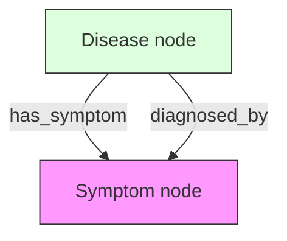

# 6.2. Graph Theory and MultiDiGraphs

Once you have your Triplets (Chapter 6.1), you need a place to put them. You used the **NetworkX MultiDiGraph** library. This note explains the mathematics of that choice.

## 1. Directed Graphs (DiGraphs)
Medicine is a "One-Way Street."
- **Correct**: Disease $\rightarrow$ `has_symptom` $\rightarrow$ Symptom.
- **Why?**: Albinism causes white hair, but white hair does not "cause" Albinism.
- **The Graph**: Every link (edge) in your graph has a **Directional Arrow.** This prevents the model from making "Reverse Logic" errors.

## 2. MultiDiGraphs (The "Complex" Links)
In biology, two things can be related in many ways. A regular graph only allows **one link** between two points. A **MultiDiGraph** allows many.

### The Project Example:
- **Node A (Albinism)** and **Node B (Nystagmus)**
- Link 1: `is_common_phenotype` (Albinism usually has nystagmus).
- Link 2: `is_primary_diagnostic_marker` (Nystagmus is how we diagnose Albinism).
- **The Result**: A MultiDiGraph keeps both these facts. A simple graph would replace the first fact with the second.

## 3. Index-Free Adjacency (The Speed Factor)
In a SQL database, the computer has to search through thousands of rows to find a link.
In your **NetworkX Graph**, every node is **physically connected** to its neighbors in the computer's memory.
- **Math Logic**: Searching for a connection is a **Constant Time** operation ($O(1)$), meaning the graph stays fast even if you add a million rare diseases.

---

## Important Reminders
- **Traversal**: Tell the jury: *"We didn't just 'search' our data; we 'traversed' it. We jumped from node to node at the speed of electricity."*
- **Predicates**: Every link (edge) in your graph has a "Label" (the predicate). This label is what guides the AI's reasoning.

