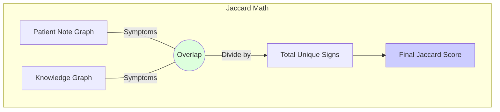

# 8.3. Jaccard Similarity and Biological Overlap

Earlier (Chapter 4), we discussed **Cosine Similarity** (Text). This note explains the **Final Validation** method: **Jaccard Similarity** (Facts).

## 1. The Intersection over Union (IoU)
Jaccard similarity doesn't care about words or "vibes." It cares about **Sets.**

### The Formula:
$$ J(A, B) = \frac{|A \cap B|}{|A \cup B|} $$

- **A (Set 1)**: The list of symptoms/genes extracted from the patient note.
- **B (Set 2)**: The formal list of symptoms/genes for a disease in the Knowledge Graph.
- **$\cap$ (Intersection)**: The specific HPO/MONDO IDs they **Both** share.
- **$\cup$ (Union)**: The total number of unique IDs mentioned in both.

## 2. The Biological Fact-Check (Professor's Requirement)
The Professor required a comparison that isn't just "Vectors." Cosine similarity checks if it *sounds* right (The "Vibe"). Jaccard similarity checks if the **biological facts** (Genes, Symptoms) actually overlap.

### Graph-vs-Graph Comparison:
1.  **Patient Graph**: {Nystagmus, White hair}. 
2.  **Disease Graph**: {Nystagmus, White hair, Photophobia}. 
3.  **Overlap**: 2 shared out of 3 total = **0.66**.

**Why this wins**: It’s factual and deterministic. It checks if the "Nodes" exist in the biological web, providing a layer of **scientific validation** that embeddings alone cannot offer.

---

## 3. The Venn Diagram of Medicine
Imagine two therapeutic circles. The area where they overlap is the **Intersection.** The total area is the **Union.** In rare disease diagnostics, we use this to distinguish between diseases that "look" similar but have different genetic markers.

## Reminders for the Jury
- **Binary Logic**: Jaccard is binary ($0$ or $1$). This prevents the "guessing" typically found in LLMs.
- **Scientific Judge**: If the Cosine score is 0.9 but the Jaccard score is 0.2, the architecture flags this as a **Hallucination** because the biology doesn't match the text.

