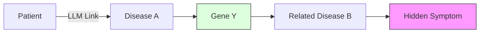

# 6.4. Multi-hop Traversal and Explainability (XAI)

This note explains the **"Reasoning Brain"** of your Knowledge Graph. This is called **Explainable AI (XAI).**

## 1. Beyond a Single Link
A standard database is a list. Your Knowledge Graph is a **Map.** Because it is a map, you can "Pathfind."

### The "Hospital Scenario":
1.  A patient has **Symptom 1**.
2.  The AI knows Symptom 1 is linked to **Disease A**. (1 Hop).
3.  The AI knows Disease A is caused by **Gene Y**. (2 Hops).
4.  The AI knows Gene Y also causes **Disease B**. (3 Hops).
5.  **The Result**: The AI can warn the doctor: *"The patient has Symptom 1. They might also eventually develop Disease B."*

### Case Study: Huntington Disease
Let's look at how the architecture reasons through a real disease:
1.  **Hop 1 (Subject $\rightarrow$ Predicate $\rightarrow$ Object)**: 
    - `[Huntington Disease] -- associated_gene --> [HTT Gene]`
2.  **Hop 2**: 
    - `[HTT Gene] -- expresses_protein --> [Huntingtin Protein]`
3.  **Hop 3**: 
    - `[Huntington Disease] -- has_symptom --> [Chorea (Involuntary movements)]`
4.  **The Result**: The AI can link a patient's "shaking movement" (Symptom) directly to the "Huntingtin Protein" defect via the graph path, even if the patient never mentioned the protein.

## 2. Why "Hops" are Superior to "Search"
In a search engine (like Google), you can't find something unless you know the name.
In your **Knowledge Graph**, you find things by their **Neighbors.** 

## 3. Explainability: The "Why"
Doctors do not trust "Black Box" AI.
- **Black Box (ChatGPT)**: *"The patient has Albinism. (Trust me, I'm a robot)."*
- **Explainable (Your Architecture)**: *"The patient has Albinism **BECAUSE** their extracted symptom 'White Hair' matches 'HPO:0001022', which is a primary marker for 'Orpha:92'."*

---

## 4. Constant-Time Reasoning
Unlike SQL Join tables, which get slower as more data is added, "Hoping" between nodes is nearly instantaneous regardless of the size. This is what makes your **"Unified Architecture"** industrial-strength.

## Tips for Presentation
- **XAI**: Always use the term "Explainable AI." It distinguishes your project from generic chatbots.
- **Traceability**: Mention that every result from your graph has a **"Pedigree"**—a clear path back to the scientific research that proved the link.

