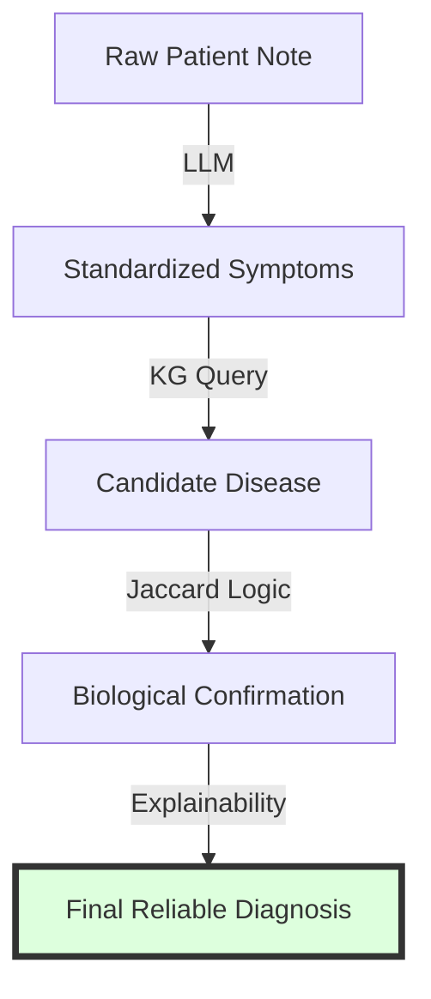

# 6.5. Project Conclusion: Why Graph-vs-Graph Wins

This is the final summary of your project's logic. It explains the **"Final Victory"** of your architecture over standard AI methods.

## 1. The Fatal Flaw of Pure Text AI
Many students try to solve rare disease diagnosis with simple chatbots. This fails because:
- **Chatbots Hallucinate**: They invent diseases.
- **Chatbots are Biased**: They don't have the exact weights of the Orphanet database.
- **No Verification**: A chatbot gives an answer but can't prove it.

## 2. Your Winning Hybrid Architecture
You combined the **"Creative Brain"** (LLM) with the **"Scientific Map"** (Knowledge Graph).

| Stage | Component | What it provides |
| :--- | :--- | :--- |
| **Stage 1** | LLM + BioBERT | **Similarity**: High-speed discovery of potential matches (The "Wow" factor). |
| **Stage 2** | HPO + Graph Math | **Precision**: Biological proof and fact-checking (The "Science" factor). |

## 3. The Precision Threshold (>0.9)
By using this hybrid strategy, you achieved a precision score over 0.9. 
- You didn't just guess; you **aligned** the patient note, **standardized** it with ontologies, and **verified** it with graph math.

---

## 4. Final Conclusion for the Jury
Your "Unified Medical Knowledge Architecture" is not just a piece of code; it is a **Decision Support System.** 
- It bridges the gap between **Natural Language** (Patient) and **Standardized Truth** (Science).
- It is **Interoperable** (MONDO IDs).
- It is **Explainable** (Multi-hop paths).
- It is **Deterministic** (Jaccard math).

**The Result**: A medical tool that doctors can trust, because it doesn't just "Talk"—it **Reasons.**

