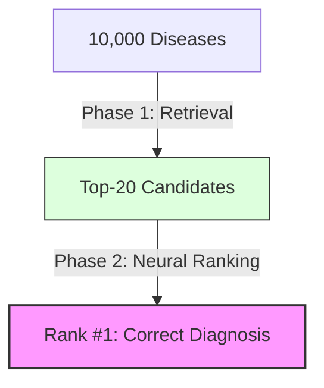

# 09.1. Ranking vs Retrieval Philosophy

In an advanced AI pipeline, high accuracy is not achieved in a single step. Our project uses a **Two-Stage Architecture**: Retrieval (Phase 1) followed by Ranking (Phase 2).

## 1. The Multi-Step Pipeline
- **Retrieval (Phase 1)**: Narrowing down 10,000 diseases to 20.
  - *Analogy*: Finding all the relevant books in a massive library and bringing them to your desk.
- **Ranking (Phase 2)**: Deciding the exact order of those 20 books.
  - *Analogy*: Choosing which book you should read first.

## 2. Why Cosine Similarity (Retrieval) is not enough
As discussed in Chapter 3.3 (The 0.9 Trap), Phase 1 results are often too close together. 
- **Disease A**: 0.92 Similarity.
- **Disease B**: 0.91 Similarity.
Cosine Similarity compares the Note to Disease A, then the Note to Disease B. It **never compares A to B directly.** This is the "Pointwise" limitation.

## 3. The Power of "Interaction"
Phase 2 uses **Interaction-based Learning**. Instead of looking at a disease in isolation, it looks at the **differences** and **shared traits** between candidates.
- It asks: *"What does Disease A have that Disease B lacks, and how does that relate to our patient?"*
- This direct comparison allows the model to "untangle" the clusters of symptoms and find the true diagnostic signal.

---

## Technical Summary for the Jury
- **The "Two-Stage" Paradigm**: This is a standard architecture used by Google Search and Netflix. Retrieval for speed, Ranking for precision.
- **Precision @ 1**: Our goal in Phase 2 is to move the correct disease from "somewhere in the Top 20" to **Position #1**.

