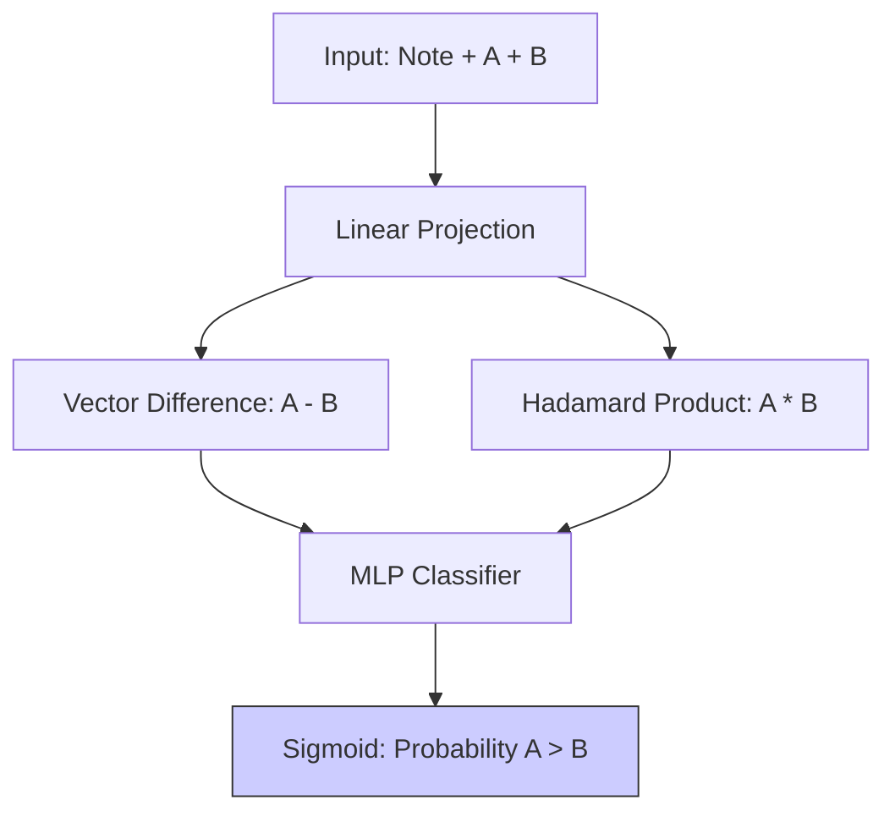

# 09.3. Neural Ranking Network Architecture

The Neural Ranker is a custom model built in **PyTorch**. Its goal is to take three vectors as input—the **Patient Note (N)**, **Disease A (A)**, and **Disease B (B)**—and decide which disease "wins" the comparison.

## 1. Interaction Features
A simple neural network would just stack the vectors together. Our architecture uses **Feature Interaction** to help the model "see" the similarities and differences.
- **Vector Difference ($A - B$)**: This shows the model exactly what Disease A has that Disease B lacks.
- **Hadamard Product ($A * B$)**: This element-wise multiplication highlights the features (symptoms) that **both** candidates share.
- **Hadamard Product ($N * A$ and $N * B$)**: This shows the model how well each candidate individually matches the patient note.

## 2. Multi-Layer Perceptron (MLP) Layers
The model is a 3-layer neural network designed for **Binary Classification**:
1.  **Linear 1**: Expands the combined interaction vectors.
2.  **Activation (ReLU)**: Adds non-linearity to the decision boundaries.
3.  **Hiddens + Dropout**: Prevents overfitting by randomly "turning off" neurons during training.
4.  **Final Linear Layer**: Reduces the data to a single score.

## 3. The Sigmoid Output
The final output is passed through a **Sigmoid Activation Function**, which squashes the score into a probability between **0.0 and 1.0**.
- **Score > 0.5**: Disease A is a better match than B.
- **Score < 0.5**: Disease B is a better match than A.

---

## Technical Details for the Jury
- **Binary Cross Entropy (BCE)**: This is the **Loss Function** used to train the network. It measures the "error" between the model's win-prediction and the ground truth.
- **Feature Engineering**: Emphasize that adding the $(A - B)$ difference was a **key architectural improvement** that raised our final accuracy in Phase 2.

