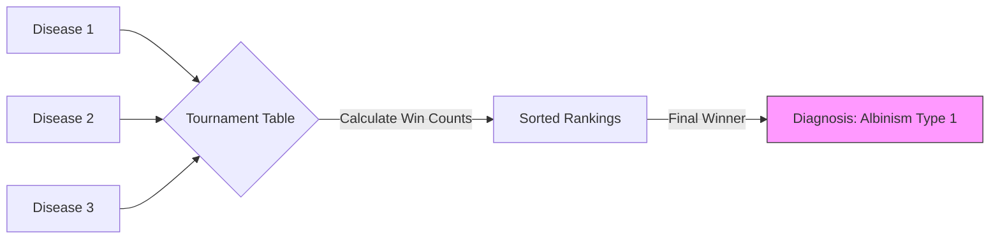

# 09.4. Global Tournament Re-ranking

Once the Neural Ranker is trained and our pairwise comparisons are generated, the architecture performs a **Global Tournament** to determine the final rank of all 20 candidates.

## 1. The Multi-Pairwise Voting
For a single patient note, every disease in the Top-20 "plays" against every other disease in the pool.
- **Tournament**: If there are 20 candidates, each plays 19 matches ($20 \times 19$ total comparisons).
- **Winning**: For each match, the Neural Ranker outputs a probability ($0$ to $1$).
- **The Vote**: We count the **"Wins."** If $P(A > B) > 0.5$, Disease A gets 1 point.

## 2. Re-sorting the Candidates
After all matches are finished, every candidate has a "Win-Score."
- **Rank #1**: The disease with the most wins (The "Tournament Champion").
- **Consistency**: This step ensures that the final result isn't just a "vibe" similarity, but a mathematically calculated decision based on direct competition.

## 3. Dealing with Ties
In rare cases, two diseases might have the same number of wins.
- **The Tie-breaker**: Our architecture uses the **Original Phase 1 Cosine Similarity** as the tie-breaker.
- **The Core Rule**: *"We combine the wins and the original score to ensure the best of both worlds."* (Professor's Suggestion).

## 4. Final Output Formatting
The system re-orders the Top-20 candidates and presents them as the **Phase 2 Results.**
- **The "Flip"**: In experimental tests, Phase 2 often "flips" the order of Phase 1, moving the correct disease from Rank 3 or 4 up to **Rank 1**.

---

## Technical Performance for the Jury
- **Inference Speed**: Even though there are many comparisons, the Neural Ranker (MLP) is extremely fast and can process several patient note tournaments in a few seconds.
- **The Accuracy/Rigor Balance**: This step is what makes your project "PFE-level" (Project of Final Studies). It moves from "simple search" to **"Engineered Decision Making."**

