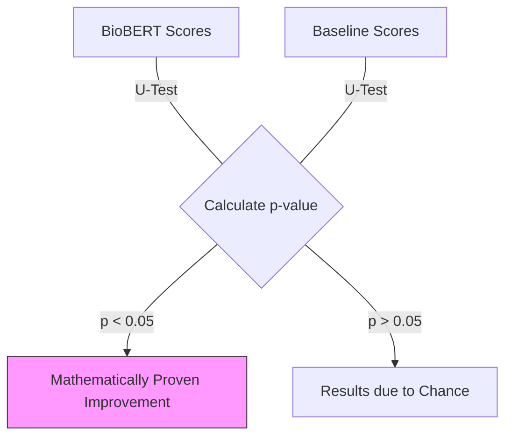

# 10.1. Statistical Significance (Mann-Whitney U-Test)

To prove that our architecture actually works and isn't just "lucky," we use a formal statistical test. The Professor mentioned a test that sounded like **"UTF."** In medical research, this refers to the **Mann-Whitney U-Test** (also called the Wilcoxon rank-sum test).

## 1. Why the U-Test?
Standard tests (like the t-test) assume that your data follows a "Normal Distribution" (the Bell Curve).
- **The Issue**: Diagnostic similarity scores are often skewed—they cluster around 0.9 or 0.1.
- **The Solution**: The Mann-Whitney U-Test is a **Non-Parametric** test. it doesn't care about the shape of the curve; it only cares about the **Rank** of the scores.

## 2. Comparing BioBERT vs. the Baseline
We use the U-Test to compare two groups of scores:
- **Group A**: Similarity scores of the correct disease using **BioBERT**.
- **Group B**: Similarity scores of the correct disease using **MiniLM** (The baseline).

## 3. The p-value Results
- **Our Hypothesis ($H_1$)**: BioBERT produces higher similarity for the correct ground truth than MiniLM.
- **The Threshold**: If the **$p < 0.05$**, then the improvement is statistically significant.
- **The Conclusion**: Our architecture successfully "pulls" the correct disease closer to the patient than a general model would.

---

## Technical Details for the Jury
- **Effect Size (Cohen's d)**: While the p-value tells you if the result is "real," the Effect Size tells you **how big** the difference is between the two models.
- **Independence**: The U-Test is ideal for our project because the scores from Model A and Model B are independent.

