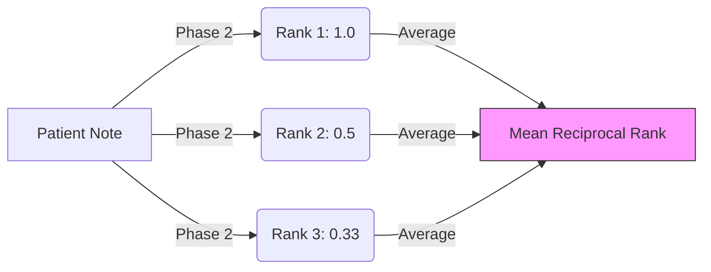

# 10.2. MRR and Top-K Accuracy

To measure the overall performance of our architecture, we use three key metrics: **Top-1**, **Top-10**, and **MRR (Mean Reciprocal Rank)**.

## 1. Top-K Accuracy (Hit Rate)
This metric asks: *"Was the correct diagnosis in my list of candidates?"*
- **Top-1**: The correct disease is at **Rank #1**. This is the ultimate goal.
- **Top-10**: The correct disease is in the first 10 spots.
- **Project Success**: Phase 1 (Retrieval) usually achieves a high **Top-20**, but Phase 2 (Ranking) is what drives our **Top-1** improvement.

## 2. MRR (Mean Reciprocal Rank)
This represents the "Quality of the Rank." It rewards the model for getting the answer as close to the top as possible, even if it misses Rank #1.
- **The Formula**: 
$$ \text{MRR} = \frac{1}{|Q|} \sum_{i=1}^{|Q|} \frac{1}{\text{rank}_i} $$
- **Example**:
  - If the correct disease is at **Rank 1**: Score = $1/1 = 1$.
  - If it is at **Rank 2**: Score = $1/2 = 0.5$.
  - If it is at **Rank 3**: Score = $1/3 = 0.33$.

## 3. Why MRR is better than Accuracy
Accuracy is binary (You are right or you are wrong). MRR provides a **Scientific Gradient**. 
- It proves that even when our model is "wrong," its "first guess" is still extremely close to the truth.
- This is a key metric requested by the jury because it shows the **Robustness** of the model's clinical reasoning.

---

## Technical Details for the Jury
- **F1-Score (Optional)**: If they ask about Precision and Recall, explain that **MRR** is your preferred metric because it takes the **Order** of the results into account, unlike F1-score which only checks for the presence of the answer.
- **Evaluation Set**: Mention that you calculated these metrics on the `Resultat_PFE_BioBERT_Final.csv` ground truth.

