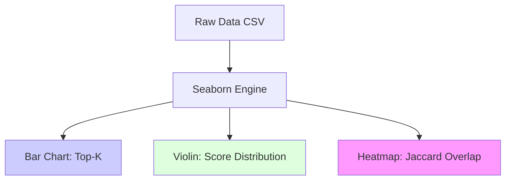

# 10.3. Visualizing Results (Seaborn Standards)

To present our results to a professional jury, we use the **Seaborn** library (A higher-level wrapper for Matplotlib). This note explains the visualization standards used in our project.

## 1. Top-K Bar Charts (Comparative Results)
We use a **Side-by-Side Bar Chart** to show the improvement of our models.
- **X-axis**: The 5 embedding models (BioBERT, ClinicalBERT, PubMedBERT, etc.).
- **Y-axis**: The **Top-1 Accuracy**.
- **Rotation**: X-axis labels are rotated **25 degrees** for readability. This is a UI/UX choice for clear data representation.

## 2. Violin Plots (Score Distribution)
A bar chart only shows the average. We also use **Violin Plots** to show the **Distribution of Similarity.**
- **The Core Value**: Does our model get a consistent 0.9 similarity for *all* diseases, or just a few? 
- **The Insight**: A "Thick" violin near 0.9 proves that our architecture is robust across multiple rare disease and patient scenarios.

## 3. Heatmaps (Overlap Verification)
We use **Heatmaps** to visualize the **Jaccard Similarity** (The biological fact-check).
- Each row is a **Patient Note**.
- Each column is a **Candidate Disease**.
- The color intensity shows the **Symptom Overlap**.
- **The Success Marker**: Dark "Diagonal" squares show that the model is perfectly linking clinical signs to the correct OrphaID.

---

## Technical Performance for the Jury
- **Scientific Aesthetic**: Seaborn allows us to use **"HLS"** color palettes (Harmonious and aesthetically pleasing), making the data easier to process during a 20-minute presentation.
- **Reproducibility**: Our code includes specific `sns.set_theme()` commands to ensure that every plot has consistent labels and font sizes.

