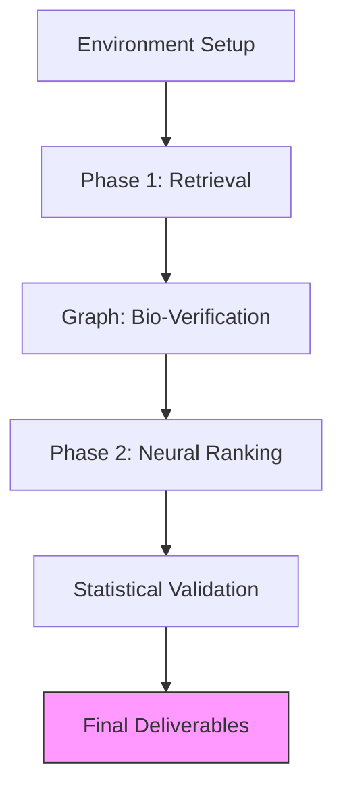

# 10.4. 24-Module Notebook Flow

The final technical implementation of the **Unified Medical Knowledge Architecture** is structured into **24 Logical Modules** within the Python notebook. This ensures that the code follows the same "Phase 1 / Phase 2" architecture as the theory.

## 1. Setup & Environment (Modules 1-5)
- **Module 1**: Cleaning the terminal by **Silencing Warnings**. This is for professional "Presentation Mode."
- **Module 2**: Importing the "Big 5" libraries (Transformers, PyTorch, NetworkX, Seaborn, Pandas).

## 2. Phase 1: Retrieval Engine (Modules 6-12)
- **Module 6**: Building the **LLM Clinical Cleaner** (Prompt Engineering).
- **Modules 7-10**: Engineering the Embedding models (BioBERT, SapBERT, etc.).
- **Module 12**: Building the **Top-K Retrieval** shortlist.

## 3. Knowledge Graph Verification (Modules 13-16)
- **Module 13**: Converting the CSV Knowledge Base into **RDF SPO Triplets**.
- **Module 15**: Building the **MultiDiGraph** in NetworkX.
- **Module 16**: Calculating the **Jaccard Similarity** (Biological Fact-Check).

## 4. Phase 2: Neural Ranking (Modules 17-21)
- **Module 17**: Constructing the **Pairwise Tournament Dataset**.
- **Module 19**: Defining the **Neural Ranking Architecture** (MLP).
- **Module 21**: Running the **Global Tournament** re-ranking.

## 5. Statistical Proof & Exports (Modules 22-24)
- **Module 22**: Running the **Mann-Whitney U-Test** (UTF Correction).
- **Module 23**: Generating the final **MRR/Acc@1** metrics.
- **Module 24**: **Final Exports**. Saving the `pfe_master_results.json` and the summary CSVs.

---

## Technical Summary for the Jury
- **Modularity**: Explain that the code is "Modular" so that any part (Phase 1, Graph, or Ranker) can be updated or replaced without breaking the entire system.
- **Master JSON**: The final `pfe_master_results.json` is the "Source of Truth" that powers your final thesis report.

