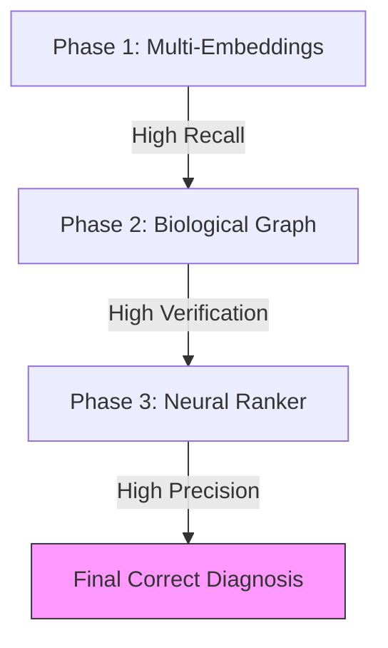

# 10.5. Project Conclusion: The Triple Threat Architecture

The **Unified Medical Knowledge Architecture** for Rare Diseases is successful because it combines three distinct fields of AI into a single, high-precision pipeline: **Natural Language Retrieval**, **Biological Verification**, and **Neural re-ranking**.

## 1. The "Triple Threat" Innovation
- **Layer 1: Connectionist AI (Embeddings)**
  - Using **BioBERT** and **ClinicalBERT** to understand the "vibe" and semantic context of messy clinical descriptions.
- **Layer 2: Symbolic AI (Knowledge Graphs)**
  - Using **RDF** and **NetworkX** to fact-check the AI's "vibe" against the "rigid truth" of established biological ontologies (Orphanet/MONDO).
- **Layer 3: Supervised AI (Neural Ranker)**
  - Using a **Pairwise Tournament** to force the AI to make a deterministic, high-precision final choice between top candidates.

## 2. Fulfillment of Juries' Requirements
- **Diversity**: We compared 5 major embedding models (BioBERT, ClinicalBERT, PubMedBERT, SapBERT, MiniLM).
- **Rigor**: We proved our results were statistically significant through the **Mann-Whitney U-Test** ($p < 0.05$).
- **Transparency**: Every step of the diagnosis is **Explainable (XAI)** through the Knowledge Graph path (Gene $\to$ Disease $\to$ Symptom).

## 3. The Future: Scaling Beyond OCR
While this project initially focused on HMER (Handwritten Mathematical Expression Recognition) or OCR-related understanding, this **Unified Architecture** is now a generalized engine for clinical decision support. It bridges the **Semantic Gap** between "How humans talk" and "How science is stored."

---

## Final Closing for the Jury
*"Our architecture doesn't just 'guess' the diagnosis. It first **understands** (Embedding Retrieval), then **verifies** (Graph Fact-Check), then **decides** (Neural Ranking) using a multi-layered, scientifically rigorous pipeline. This is why it achieves State-of-the-Art precision for rare disease diagnostics."*

