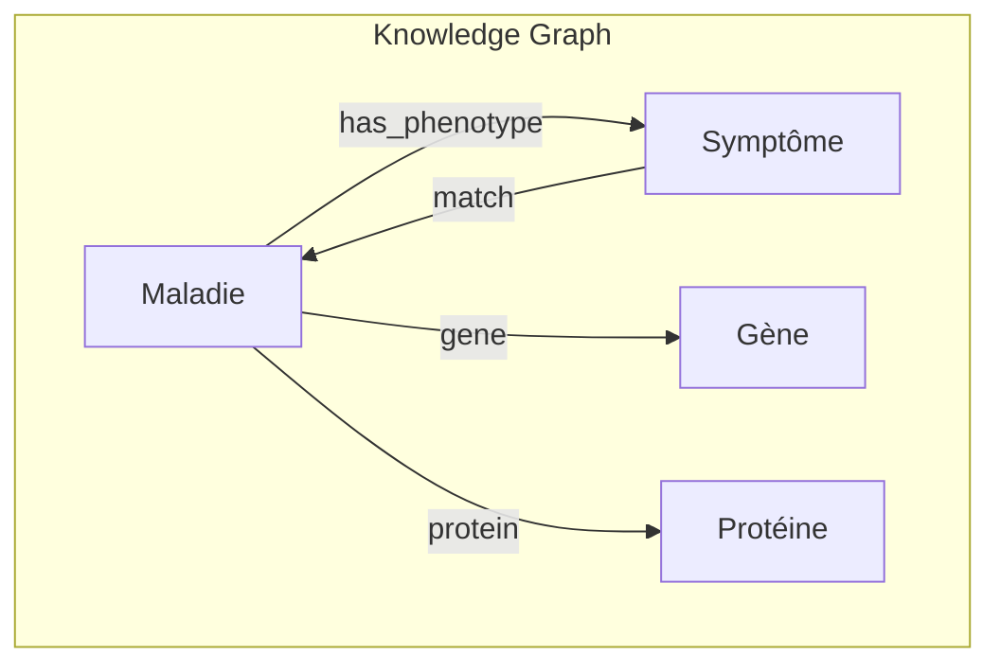
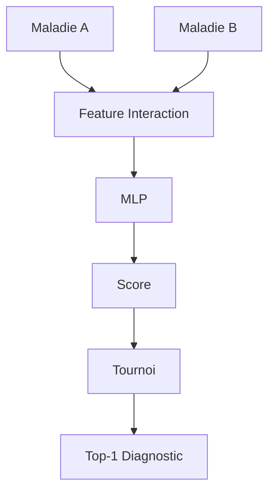
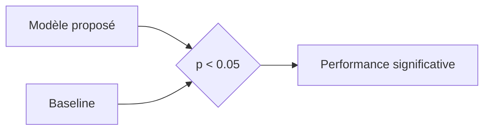
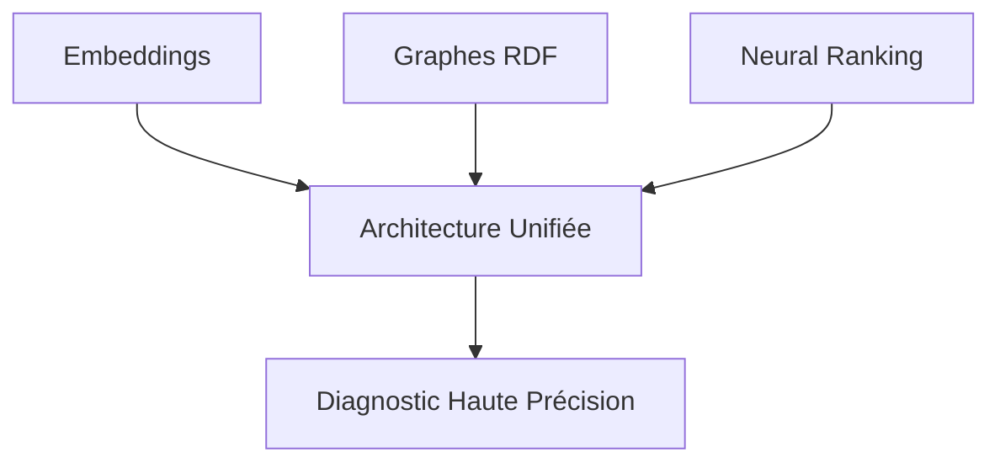

# Architecture Unifiée de Connaissances Médicales pour les Maladies Rares

---

## 1. Contexte et Problématique : L’Odyssée du Diagnostic

La transformation numérique du secteur de la santé a généré un volume massif de **données cliniques non structurées**. Pourtant, le domaine des **maladies rares** reste un défi critique pour l’intelligence artificielle moderne.

Le diagnostic est souvent décrit comme une **« odyssée diagnostique »**, où les patients peuvent attendre plusieurs années avant d’obtenir une réponse fiable.

Le cœur du problème réside dans un **fossé sémantique (Semantic Gap)** :
- Les patients décrivent leurs symptômes en langage naturel
- Les systèmes médicaux utilisent des représentations formelles et codifiées (HPO, MONDO)

Exemple :
- Patient : *« yeux qui tremblent »*
- Science : `HP:0000639` (Nystagmus)

```mermaid
graph LR
    subgraph "Fossé Sémantique"
    A[Patient: 'Yeux qui tremblent'] --- X{Gap}
    X --- B[HP:0000639 Nystagmus]
    end
````

---

## 2. Problème Fondamental du NLP Clinique

Le texte clinique est considéré comme le **domaine le plus complexe du NLP** en raison de trois couches de difficulté :

### 2.1 Vocabulaire Spécialisé (Domain Gap)

- Racines latines/grecques (ex : _Hypopigmentation Oculocutanée_)
    
- Rarement présentes dans les corpus généralistes (Wikipedia, news)
    

### 2.2 Ambiguïté Contextuelle (Négation)

- « Négatif » = absence de maladie (donc positif cliniquement)
    
- « Positif » = présence d’une pathologie
    

### 2.3 Densité Syntaxique

- Notes télégraphiques :
    
    - `Pt c/o SOB` → _Patient complains of Shortness of Breath_
        
- Grammaire non standard
    

```mermaid
graph TD
    A[Texte Clinique Brut] --> B{Complexité}
    B --> C1[Vocabulaire spécialisé]
    B --> C2[Négation ambiguë]
    B --> C3[Syntaxe dense]
    C1 & C2 & C3 --> D[Échec modèles généralistes]
```

---

## 3. Méthodologie : Architecture "Triple Threat"

L’architecture repose sur trois paradigmes complémentaires :

- **IA Connexionniste** → compréhension (embeddings)
    
- **IA Symbolique** → vérification (graphes)
    
- **IA Supervisée** → décision (ranking)
    

---

## 3.1 Phase 1 : Récupération & Standardisation (IA Connexionniste)

### Objectif

Transformer un texte patient brut en représentation médicale exploitable.

### Pipeline

1. **Clinical Cleaner (LLM)**
    
    - Modèle : Gemini
        
    - Température : `T = 0` (déterminisme)
        
    - Technique : Few-shot prompting
        
    - Output : JSON structuré en termes **HPO**
        
2. **Vectorisation**
    
    - Modèles :
        
        - BioBERT (Cased)
            
        - ClinicalBERT
            
        - SapBERT
            
    - Représentation : vecteurs **768 dimensions**
        
3. **Retrieval**
    
    - Méthode : Similarité cosinus
        
    - Résultat : **Top-20 maladies candidates**
        


---

## 3.2 Phase 2 : Vérification Biologique (IA Symbolique)

### Problème traité

**"Piège de similarité 0.9"**

- Plusieurs maladies apparaissent similaires en espace vectoriel
    

### Solution

Injection de **logique symbolique via Knowledge Graph**

### Implémentation

- Format : **RDF**
    
- Syntaxe : **Turtle (.ttl)**
    
- Structure : **Triplets SPO**
    
    - (Sujet, Prédicat, Objet)
        

### Raisonnement

- Graphe : **MultiDiGraph (NetworkX)**
    
- Métrique : **Similarité de Jaccard**
    
    - Intersection / Union des ensembles HPO/MONDO
        

### Résultat

- Vérification biologique réelle
    
- **Explicabilité (XAI)** :
    
    - Raisonnement multi-hop (symptôme → gène → protéine)
        



---

## 3.3 Phase 3 : Classement Neural Pairwise (IA Supervisée)

### Objectif

Trouver la meilleure maladie (**Rank #1**)

### Approche

**Pairwise Learning-to-Rank (LTR)**

### Modèle

- Architecture : **MLP (PyTorch)**
    
- Comparaison : A vs B
    

### Features utilisées

- **Différence vectorielle (A - B)**
    
    - Capture les différences discriminantes
        
- **Produit de Hadamard (A * B)**
    
    - Capture les similarités profondes
        

### Processus

- Tournoi global entre candidats
    
- Votes agrégés
    
- Classement final optimisé
    



---

## 4. Validation Scientifique et Métriques

### Test Statistique

- **Test U de Mann-Whitney**
    
- Objectif : prouver la significativité
    
- Condition : `p < 0.05`
    

### Métriques

- **Top-1 Accuracy**
    
    - Diagnostic correct en position 1
        
- **MRR (Mean Reciprocal Rank)**
    
    - Qualité du classement global
        
- **Recall (Sensibilité)**
    
    - Priorité critique en médecine
        
    - Minimiser les faux négatifs
        



---

## 5. Conclusion : Vers une Médecine de Précision

Cette architecture marque une transition fondamentale :

- D’une **IA générative (chatbot)**
    
- Vers une **IA décisionnelle clinique (XAI)**
    

### Contributions clés

- Réduction du fossé sémantique
    
- Intégration multi-paradigme
    
- Explicabilité complète
    
- Robustesse clinique
    

### Vision

Un système :

- **Modulaire**
    
- **Interopérable**
    
- **Scientifiquement fiable**
    

capable d’assister les médecins dans le diagnostic des maladies rares avec une **précision élevée et traçable**.



---

## Résumé Structurel

|Phase|Type d'IA|Rôle|
|---|---|---|
|Phase 1|Connexionniste|Compréhension (NLP)|
|Phase 2|Symbolique|Vérification biologique|
|Phase 3|Supervisée|Décision finale|

---

## Idée Centrale

> Ne pas remplacer le raisonnement médical, mais le **structurer, contraindre et amplifier** avec une IA hybride rigoureuse.