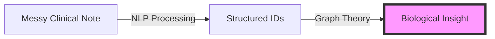

# 1.1. The Medical Text Problem

The reason your **"Unified Medical Knowledge Architecture"** project is scientifically significant is that clinical text is one of the most difficult "unstructured" data sources for AI to handle. Unlike a newspaper article or a book, a medical note is dense, chaotic, and highly specialized.

## 1. The Core Challenges

### 1.1. Specialized Vocabulary (The Domain Gap)
Medical language uses **Latin and Greek roots** that are rarely found in everyday English.
- **Example**: Terms like *"Oculocutaneous Hypopigmentation"* or *"Sensorineural Hearing Loss"* are dense and rare in general text.
- **The Problem**: If an AI is only trained on Wikipedia, it might know what "Skin" is, but it will see "Hypopigmentation" as a rare, low-probability sequence of letters, losing the semantic meaning.

### 1.2. Contextual Ambiguity (The Negation Trap)
In medicine, the word **"Negative"** is a positive result, and **"Positive"** is a negative result.
- **Example**: *"Patient tested positive for COVID-19"* vs. *"The results were negative."*
- **The Problem**: A general AI might associate "Positive" with "Good/Success." In a clinical note, this leads to dangerous misinterpretations of the patient's state.

### 1.3. Syntactic Density & Abbreviations
Doctors often write in "Medical Shorthand" to save time. 
- **Doctor's Note**: *"Pt c/o SOB on exertion, PMH of CHF."*
- **Translation**: *"Patient complains of Shortness of Breath on exertion, Past Medical History of Congestive Heart Failure."*
- **The Problem**: Standard NLP parsers (like spaCy or NLTK) look for verbs and subjects. In clinical notes, these are often missing, causing the parser to fail.

---

## 2. The Project's Mission: Bridging the Semantic Gap

Your project works as a **"Clinical Bridge."** It takes the "Messy Human Talk" (Natural Language) and transforms it into the "Rigid Scientific Truth" (Structured IDs).

### The Transformation Chain:
1.  **De-noising**: Cleaning the raw text (e.g., rephrasing patient notes).
2.  **Vectorization**: BERT turns clinical terms into **768-D Vectors**.
3.  **Ontology Alignment**: Links these vectors to standardized "Truth" (Orphanet/HPO).
4.  **Graph Construction**: Connecting those truths into a biological web.

---

## Reminders and Presentation Tips
*   **The "Vibe" vs the "Science"**: When you "vibed" the code together initially, you were relying on the general patterns the AI learned. Now, we are enforcing medical rigor by using specialized models like BioBERT.
*   **Student Trick**: If a supervisor asks why we don't just use ChatGPT for everything, remind them that medical ethics and scientific reproducibility require deterministic, verifiable structures like Knowledge Graphs.
*   **Clinical Accuracy**: Emphasize that in medicine, a 1% error in NLP can lead to a 100% wrong diagnosis. 

