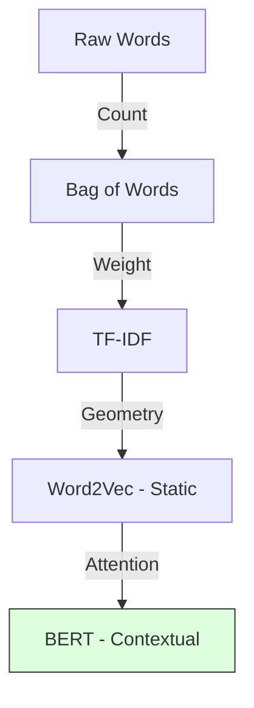

# 1.2. The History of NLP Vectors

To understand why your project uses **BioBERT**, you must first witness the evolution of how humans taught computers to "read." Each stage solved a problem but left a mathematical gap.

## 1. The Bag-of-Words Era (BoW)
In the early days, text was treated as a "bag." We ignored order and simply counted words.
- **The Logic**: If "Fever" appears 3 times, the vector has a `3` in the "Fever" index.
- **The Failure**: It ignores **Meaning**. *"The dog bit the man"* and *"The man bit the dog"* look identical.
- **Clinical Flaw**: It doesn't know that "Heart Attack" and "Myocardial Infarction" are the same thing because they are different words.

## 2. TF-IDF (The Importance Weight)
**Term Frequency-Inverse Document Frequency** was the first attempt at clinical relevance.
- **The Math**: $TF \times \log(\frac{N}{DF})$
- **The Logic**: It penalizes common words (like *"the"*, *"is"*) and boosts rare, technical words (like *"Hypopigmentation"*).
- **The Failure**: While it knows "Hypopigmentation" is important, it still treats words as isolated islands. There is no biological relationship between words.

## 3. Static Embeddings (Word2Vec / GloVe)
The first "Neural" breakthrough (2013). Words were mapped to fixed points in 300-D space.
- **The Power**: For the first time, computers could do **Word Algebra**:
  $Vector(\text{"King"}) - Vector(\text{"Man"}) + Vector(\text{"Woman"}) \approx Vector(\text{"Queen"})$.
- **Clinical Success**: It learned that "Cardiac" and "Heart" are physically near each other in space.
- **The Final Problem**: **Context.** In the sentence *"The river bank is high"* vs. *"The bank loan is high,"* the word "Bank" has the exact same vector. The computer is confused by the same word having different meanings.

## 4. The Transformer Revolution (2017+)
**This is the era your project lives in.** 
Instead of a fixed vector for a word, the vector **changes** based on every other word in the sentence.
- **The result**: A dynamic, contextual embedding where "Bank" (river) and "Bank" (money) are completely different numbers.
- **Project Role**: This allows your code to distinguish between *"No signs of fever"* and *"Confirmed fever."*

---

## Tips for the Jury
- **Dimensions of Meaning**: Explain that vectors are "The coordinates of a thought." 
- **The "Fuzzy" Match**: Unlike a keyword search (BoW), vectors allow your project to find a disease even if the patient uses a synonym.

