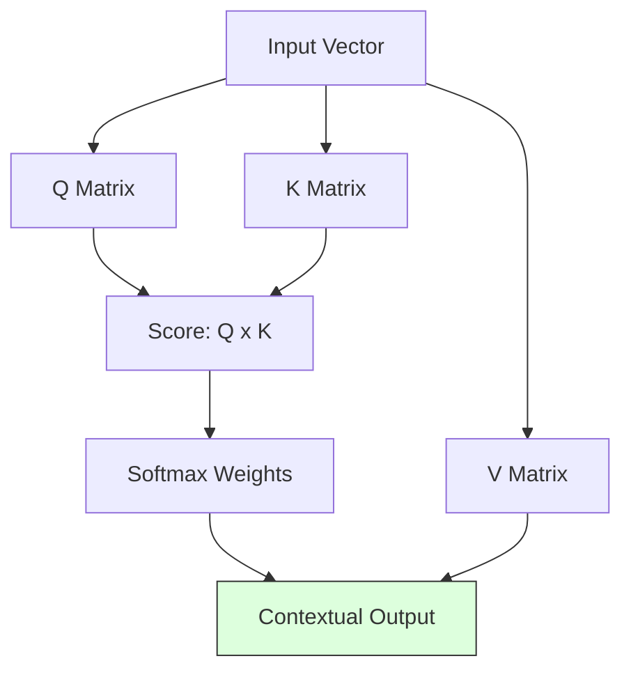

# 1.3. The Transformer Engine

The **Transformer** is the engine inside BERT. Its greatest superpower is **Self-Attention**. This note explains the mathematics behind how the model "focuses" on relevant clinical facts.

## 1. The Core Logic: Query, Key, and Value (QKV)
Imagine you are a word in a sentence (e.g., *"Albinism"*). To understand your meaning, you "look" at every other word and ask: *"How relevant are you to me?"*

The math works like this:
1.  **Query (Q)**: "What am I looking for in this sentence?" (e.g., "I am looking for symptoms or genes").
2.  **Key (K)**: "What information do I offer to other words?" (e.g., "I am a clinical noun").
3.  **Value (V)**: "What is my actual content?"

### The Scaled Dot-Product Attention Formula
$$ \text{Attention}(Q, K, V) = \text{softmax}\left(\frac{QK^T}{\sqrt{d_k}}\right)V $$

*   **$QK^T$**: The computer multiplies your Query by everyone else's Key. If they "match" (high alignment), the score is high.
*   **$\sqrt{d_k}$**: A scaling factor to keep the numbers stable.
*   **Softmax**: This turns the scores into percentages (e.g., 85% focus on *"hypopigmentation"*, 5% focus on *"and"*).
*   **V (Value)**: Finally, the model takes the Value of the important words and builds your new contextual vector.

## 2. Multi-Head Attention (The Parallel Brain)
BERT doesn't just look at the sentence once. It has **12 or 16 "Heads"** working in parallel.
*   **Head 1**: Might focus on **Grammar** (Who is the subject?).
*   **Head 2**: Might focus on **Medical Entities** (Which words are symptoms?).
*   **Head 3**: Might focus on **Negation** (Does the sentence say "No" or "Not"?).

### The Syntactic Trap: Why Attention is necessary
In a clinical note, the word *"No"* is extremely important. 
- **Sentence A**: *"The patient **has** cancer."*
- **Sentence B**: *"The patient **does not have** cancer."*
These sentences share 5 out of 6 words (85% overlap). A simple model would say they are nearly identical. 
- **BERT's Solution**: Because BERT looks at the entire sentence at once, its "Negation Heads" pay 100% attention to the relationship between *"No"* and *"Cancer"*, flipping the meaning of the resulting 768-D vector. This prevents the "Syntactic Trap" where opposites look like matches.

---

## 3. The Softmax Derivation (Optional Detail)
The Softmax function ensures that all "Attention" adds up to **1.0**.
$$ \sigma(z)_i = \frac{e^{z_i}}{\sum_{j=1}^K e^{z_j}} $$
- It takes a list of raw scores and "squashes" them into probabilities. This is why the AI can be "80% sure" that one word is more important than another.

## Reminders and Background
- **Parallelism**: Unlike older models (RNNs/LSTMs) that read words one-by-one, Transformers read the **entire sentence at once**. This is why they are so fast and good at long-distance relationships in text.
- **The "Attention" is the model**: There are no hidden "recurrent" loops. The intelligence of your project comes entirely from these QKV interactions.

