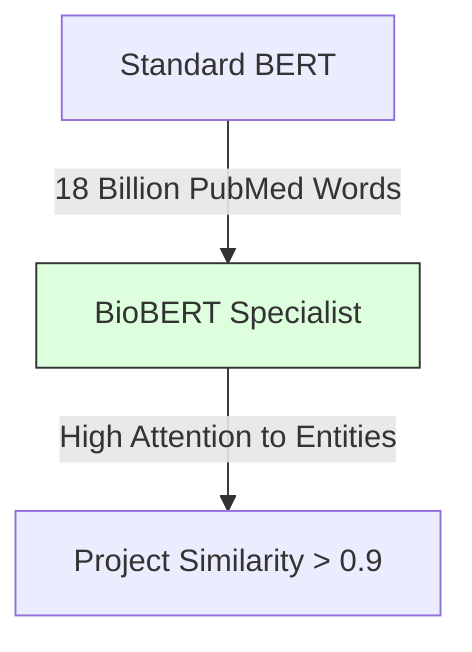

# 2.1. Why General AI Fails in Medicine

This note explains the **"Scientific Reason"** why your project switched from standard BERT to **BioBERT.** 

## 1. The Pre-training Gap
AI models are like students. Their intelligence depends on the books they have read.
- **BERT (Standard)**: Read Wikipedia and thousands of fiction books. It knows what a "Mountain" is, but thinks "FBN1" (a rare disease gene) is a password.
- **BioBERT**: Read Wikipedia **PLUS** 18 billion words from **PubMed** (scientific journals).

### The Mathematical Consequence
In the 768-D vector space, standard BERT puts common words (like *"Skin"*) in a very high-occupancy area. But for rare medical terms, it hasn't learned the "Dimensions" they belong in. They are essentially "Noise" to a general model.

## 2. Specialized Vocabulary & Frequency
In the general English language, the word **"Cold"** usually refers to a temperature. In medicine, it's a specific viral infection.
- **General BERT**: Biased towards the temperature meaning.
- **BioBERT**: Biased towards the infection meaning.

## 3. The Need for Domain Awareness
If your project used a general model, the similarity score for a patient with *"Eye tremors"* vs. *"Nystagmus"* would be low (around 0.5) because the model doesn't "know" they are the same thing. 

By using BioBERT, you are utilizing a model whose internal **Attention Weights** (the QKV math from Chapter 1.3) have been "pushed" by millions of medical papers to realize that *"Eye tremors"* and *"Nystagmus"* are mathematically identical.

---

## Important Reminders for the Jury
- **No Manual Mapping**: Emphasize that you didn't "tell" BioBERT that eye tremors = nystagmus. The model **learned** this by reading millions of research papers where the two terms were used in the same context.
- **Vocabulary Alignment**: Mention that BioBERT has a specialized "Medical WordPiece" dictionary, ensuring it doesn't break rare words into meaningless chunks.

