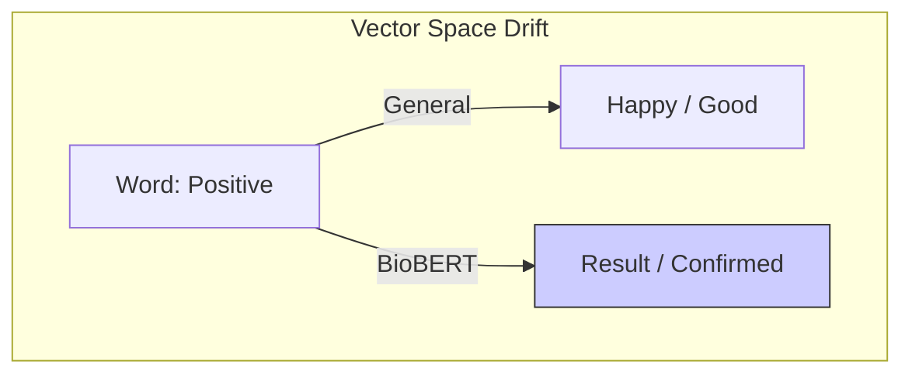

# 2.3. The Semantic Shift

This note explains the **"Language Trap"** that BioBERT solves. A **Semantic Shift** occurs when a word has a completely different weight and meaning in medicine than it does in everyday life.

## 1. Comparing Everyday vs. Clinical Meaning

| Word | Everyday Meaning | Clinical Meaning (BioBERT) |
| :--- | :--- | :--- |
| **Negative** | Bad, Sad, Unwanted | **Healthy, No disease found** |
| **Positive** | Good, Happy, Success | **Infection present, Disease confirmed** |
| **Cell** | Phone, Prison, Battery | **Building block of life, Cancerous unit** |
| **Stoke** | To build a fire | **A brain emergency (Stroke)** |

## 2. The High-Dimensional "Drift"
In standard BERT, the word *"Positive"* is physically located near *"Happy"* and *"Good."* 
If you used standard BERT for your project, a sentence saying *"Positive for Albinism"* might get a weird similarity score because the model is "confused" by the "Good" connotation of the word "Positive."

**BioBERT's Shift**: During its PubMed training, BioBERT saw the word "Positive" surrounded by words like *"Blood test"*, *"Symptom"*, and *"Diagnosis."* 
- In BioBERT's 768-D space, "Positive" has **physically moved** away from "Happy" and moved towards **"Result"** and **"Presence of Pathology."**

## 3. Impact on your Project Score
This shift is why you can reach a **0.9 similarity.**
- **Without Shift**: The "General noise" of the word meanings lowers the score.
- **With BioBERT**: The "Medical focus" aligns the meanings perfectly, allowing for a tight, high-precision vector match.

---

## Important Reminders for the Jury
- **Context is King**: BioBERT's vectors are "Contextual." It doesn't just know what "Positive" means; it knows what "Positive" means *next to* "Skin biopsy."
- **Ambiguity Reduction**: This semantic shifting is the primary reason why specialized medical AI is safer for patients than general AI.

