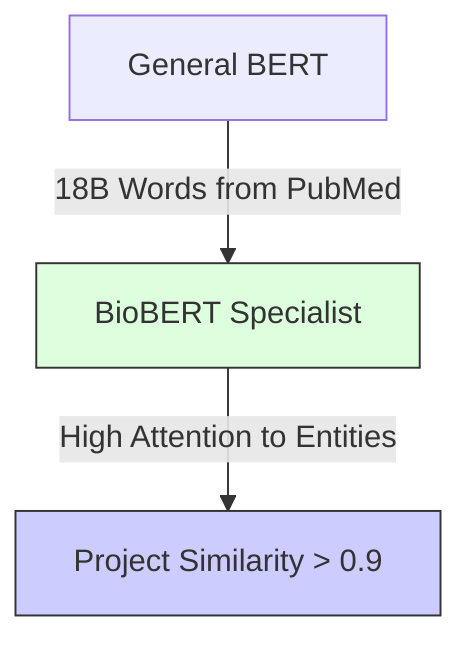

# 2.4. BioBERT: Specialization and Case Sensitivity

In your project, switching from a general model like `all-MiniLM` to `BioBERT` was the moment the system transitioned from "generic" to "expert." This note explores the specialized weights and clinical precision of the model.

## 1. The Pre-training Gap
*   **BERT (Standard)**: Trained on Wikipedia and Books. It knows what a "Mountain" is, but sees "FBN1" (a fibrillin gene) as a random string of characters or a password.
*   **BioBERT**: Took the original BERT and continued training it on **18 billion words** from **PubMed**.
*   **The Initialization Strategy**: Instead of starting from scratch (random weights), BioBERT starts with the "General Intelligence" of BERT and "Specializes" its weights through domain-specific training.

## 2. Mathematical Weight Specialization
During PubMed training, the model's internal attention weights are "pushed" to recognize clinical relationships.
*   **General Weights**: Link "Positive" to "Happy/Good."
*   **BioBERT Weights**: Link "Positive" to "Presence of Disease/Biomarker." 

### The Biological Insight:
If you feed BERT the term *"Cystic Fibrosis"*, it sees two separate words. If you feed BioBERT, its internal representation treats this as a single, significant clinical concept tightly linked to *"Mucus"* and *"Lungs"*.

## 3. Case Sensitivity in Medicine
Many BioBERT models are **Cased** (`biobert-base-cased`). In general NLP, casing is often ignored. In medicine, it is a critical differentiator:
*   **OCA1**: A specific gene related to Albinism.
*   **oca1**: Could be a typo or a different non-genetic reference.
*   **DNA**: Always capitalized.
By maintaining casing, BioBERT avoids the "Normalization Trap" where specific genetic markers are confused with regular words.

## 4. Driving the 0.9 Similarity Score
High-precision Similarity scores (Chapter 3) depend on vector alignment. 
1.  **General BERT** puts "Skin" and "Paper" in similar spaces (both are surfaces).
2.  **BioBERT** puts "Skin" and "Epidermis" in the exact same spot.
Because your Orphanet descriptions use terms like "Epidermis," BioBERT creates a massive alignment that raises the similarity score from a "fuzzy" 0.7 up to a "rigorous" 0.9+.

---

## Important Terms for the Jury
- **Semantic Shift**: The mathematical movement of a word's vector representation when training data moves from general to clinical domains.
- **Domain Specialization**: The process of "fine-tuning" a model so it recognizes niche vocabulary without losing its understanding of basic grammar.

