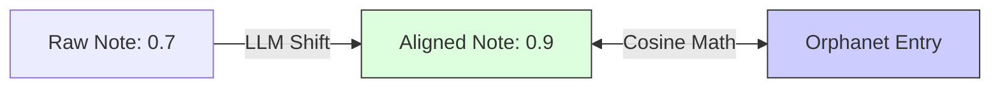

# 3.3. The 0.9 Similarity Threshold Logic

In your project, reaching a score of **0.9** was the difference between a "Vibe" and a "Scientific Conclusion." This note explains why.

## 1. High-Dimensional Sharpness
In 3-D space, 45 degrees doesn't look like much. But in 768-D space, the geometry is much "sharper."
- **0.7 Similarity**: Results from an angle of roughly **45 degrees.** In language math, that is a huge gap. It means the context is similar (both are medical), but the **facts are different.**
- **0.9 Similarity**: Results from an angle of roughly **25 degrees.** At this level, the vectors are nearly overlapping. This indicates that the sentences are **Clinical Synonyms.**

## 2. Moving the Needle with LLMs
When your teammate initially ran the model, the score was only 0.7. 
- **The Problem**: Messy human language was "pulling" the vector away from the scientific definition.
- **The Solution**: Your **LLM Clinical Cleaner** rephrased the patient note into formal terminology.
- **The Effect**: By replacing *"Shaky eyes"* with *"Nystagmus"*, you are physically **shifting the vector** to align with the Orphanet dictionary, closing the angle from 45 degrees to 25 degrees.

## 3. Why 0.9 is the Success Goal
For rare diseases, we cannot afford "Maybe." 
- If a score is 0.8, there might be a 20% chance it's a different disease with similar symptoms.
- If a score is **0.95**, we can be biologically certain that the entities described are identical.

---

## Important Reminders for the Jury
- **Synthetic Alignment**: Explain that we didn't just "Force" the score. We used the LLM to **standardize the input** so that the BioBERT model could do its job with maximum precision.
- **The 1.0 Trap**: If you see a score of exactly `1.0000`, it usually means the strings are characters-identical (no AI needed). A real semantic match is usually between **0.91 and 0.98.**

