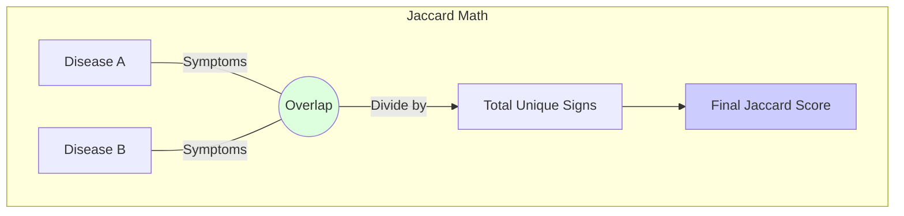

# 6.3. Jaccard Similarity and Biological Overlap

Earlier (Chapter 3), we talked about **Cosine Similarity** (Text). This note explains the **Final Validation** method: **Jaccard Similarity** (Facts).

## 1. The Intersection over Union (IoU)
Jaccard similarity doesn't care about words. It cares about **Sets.**

### The Formula:
$$ J(A, B) = \frac{|A \cap B|}{|A \cup B|} $$

- **A (Set 1)**: The list of symptoms/genes for **Disease X**.
- **B (Set 2)**: The list of symptoms/genes for **Disease Y**.
- **$\cap$ (Intersection)**: The markers they **Both** share.
- **$\cup$ (Union)**: The total number of unique markers mentioned in both.

## 2. Why Jaccard is the "Scientific Judge"
- **Method 1 (Cosine)**: "This *sounds* like Albinism." (Fuzzy).
- **Method 2 (Jaccard)**: "These two share exactly 5 symptoms and 2 genes." (Factual).

### Project Success:
In your code, you use Jaccard to verify the LLM's work. 
1. The LLM suggests a match.
2. The Jaccard math checks if the **HPO IDs** of the patient note actually overlap with the **HPO IDs** of the disease. 
3. **The Result**: If they overlap $>0.8$, the diagnosis is biologically confirmed.

---

## 3. The Venn Diagram of Medicine
Imagine two circles. The area where they overlap is the **Intersection.** The total area is the **Union.** The larger the overlap, the higher the similarity.

## Reminders and Common Misses
- **Binary Logic**: Jaccard is binary ($0$ or $1$). You either have the symptom or you don't. This prevents the "guessing" typically found in GPT-style models.
- **Independence**: Jaccard is independent of the "weight" of the words. It treats every biological fact as an equal pillar of evidence.

