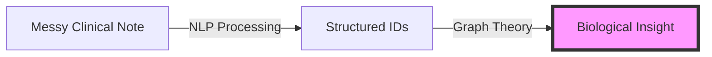

# 1.1. The Medical Text Problem

Clinical notes are considered the **"Final Boss"** of NLP because they occupy the intersection of three difficult areas: specialized vocabulary, contextual ambiguity, and syntactic density.

## 1. The Core Challenges

### 1.1. Specialized Vocabulary (The Domain Gap)
Medical language uses **Latin and Greek roots** (e.g., *"Oculo-cutaneous Hypo-pigmentation"*) which do not appear in general training sets like Wikipedia or common news corpora.
- **The Problem**: Standard BERT models see rare medical terms as low-probability tokens, often failing to capture their true biochemical significance.
- **Example**: In a general model, "Albinism" might be linked to "Skin," but it lacks the deep connection to "Melanin pathways" or "FBN1 mutations" required for rare disease diagnosis.

### 1.2. Contextual Ambiguity (The Negation Trap)
In medicine, the word **"Negative"** is usually a positive clinical outcome (absence of disease), while **"Positive"** is a negative health outcome.
- **Semantic Shift**: General AI often associates "Positive" with "Sentiment: Good." In clinical notes, this lead to "Sentiment-Ambiguity."
- **Example**: *"Patient positive for hypertrophic cardiomyopathy"* vs *"Negative for chest pain."*

### 1.3. Syntactic Density and Doctor Shorthand
Doctors write in a telegraphic style to save time, often omitting verbs and subjects entirely. This is known as **Syntactic Density**.
- **The Problem**: Standard NLP parsers (spaCy/NLTK) rely on grammatical structure (Subject-Verb-Object). Clinical notes break these rules.
- **Example (Doctor's Note)**: *"Pt c/o SOB on exertion, PMH of CHF."*
- **Translation**: *"Patient complains of Shortness of Breath on exertion; Past Medical History of Congestive Heart Failure."*
- **Technical Gap**: Words like "c/o" (complains of) or "SOB" (shortness of breath) must be mapped to formal HPO (Human Phenotype Ontology) terms during the **Retrieval Phase**.

---

## 2. Reminders for the Jury Defense

*   **The "Final Boss" Analogy**: Use this to explain why specialized models (BioBERT) are mandatory, not optional.
*   **Scientific Reproducibility**: Emphasize that while LLMs (like Gemini) can "guess" the meaning, your architecture enforces structure via **Ontology Alignment** and **Knowledge Graphs**.
*   **Data Quality**: Emphasize that in medicine, a 1% error in NLP can lead to a 100% wrong diagnosis. 

