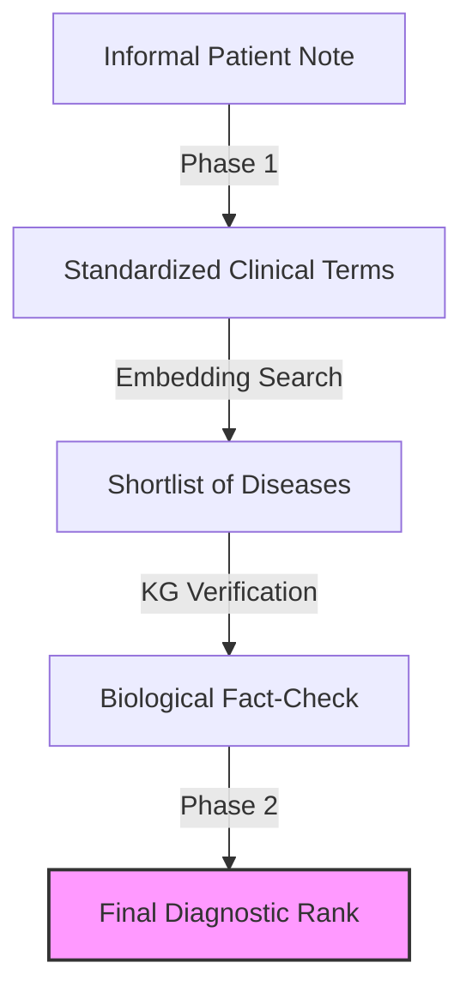

# 1.3. The Mission: Bridging the Semantic Gap

The core objective of the **Unified Medical Knowledge Architecture** is to act as a **"Clinical Bridge."** It takes the "Messy Human Talk" (Natural Language) and transforms it into "Rigid Scientific Truth" (Structured Ontological IDs).

## 1. The Semantic Gap
There is a massive disconnect between how patients describe symptoms and how medical databases (like Orphanet) store them.
- **Patient Talk**: "My kid's eyes keep shaking and his skin is very pale."
- **Scientific Truth**: `HP:0000639` (Nystagmus) and `HP:0001010` (Hypopigmentation).

## 2. The Transformation Chain
To bridge this gap, the architecture follows an 4-step pipeline:

1.  **Phase 1: Retrieval & De-noising**
    - Using an **LLM Clinical Cleaner** to translate informal prose into formal medical terminology.
    - Narrowing down 10,000+ diseases to the **Top-20 candidates** using Vector Similarity.
2.  **Biological Verification (Graph Theory)**
    - Fact-checking the "vibe" of the vectors against the "truth" of the Knowledge Graph.
    - Using **Jaccard Similarity** to check if the biological facts (Genes/Phenotypes) actually overlap.
3.  **Phase 2: Neural Re-ranking**
    - A dedicated **Pairwise Ranking Network** (Tournament Logic) to decide the final diagnostic order.
4.  **Statistical Validation**
    - Proving that the results are statistically significant ($p < 0.05$) using the **Mann-Whitney U-Test**.

## 3. Why this Architecture Wins
By combining **Connectionist AI** (Embeddings) with **Symbolic AI** (Graphs), we achieve:
- **Explainability**: We can show exactly *why* a diagnosis was chosen (The Graph Path).
- **Precision**: We avoid the "hallucinations" of standard LLMs by grounding every result in established medical ontologies.

