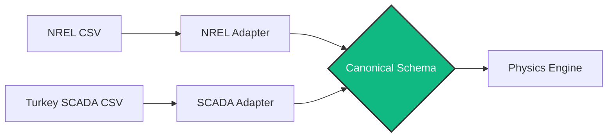

## 2.1 The Adapter Design Pattern
### The Problem with Real World Data
In your project, you utilized two entirely different wind datasets:
1.  **NREL (Simulated):** A massive meteorological dataset (8 years of hourly data, ~60,000 rows after initial processing) providing weather forecasts but often missing actual power generation data or containing "N/A" values.
2.  **Turkey SCADA (Real):** High-fidelity sensor data (~50,000 rows) from a physical turbine, complete with sensor glitches, maintenance shutdowns, and unique column names.

If you write hardcoded scripts to read these files, your code becomes brittle. If a new dataset arrives tomorrow with different column names, the whole system crashes.

### The Solution: Software Adapters
We utilized a Software Engineering principle called the **Adapter Pattern**. 

An Adapter acts like a universal travel plug. 
1.  We define a **Canonical Schema** (`src/core/schema.py`) (a strict, single source of truth for column names like `WIND_SPEED_MS` and `ACTIVE_POWER_KW`).
2.  Each dataset gets its own small, specialized class (`NRELAdapter`, `TurkeyAdapter`) in `src/ingestion/loaders.py`.
3.  The Adapter's only job is to load the messy specific file, rename the columns to match the Schema, fix the date formats, and output a clean, standardized DataFrame.