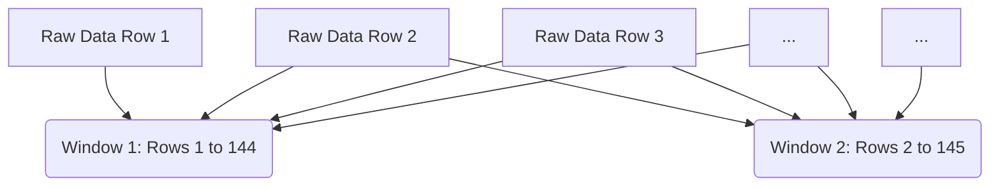

## 4.1 The Sliding Window Strategy & 3D Tensors
Standard Machine Learning models (like XGBoost) look at a single row of data (e.g., the weather at 12:00 PM) and predict the power at 12:00 PM. They lack temporal context.

To predict the *future* and capture the *momentum* of a storm, we must provide historical context. Deep learning models (LSTMs/GRUs) require data to be formatted as a **3D Tensor**: `[Batch_Size, Sequence_Length, Features]`.

*   **Lookback ($L$):** We set the lookback to 144 steps (24 hours at 10-minute intervals). This provides a full day's context to the AI.
*   **Forecast ($H$):** The model is designed to predict 288 steps (48 hours).
*   **Tensor Shape Example:** `(128, 144, 10)` means 128 windows per batch, each containing 144 historical time steps, each with 10 physics features.

Every sample fed into the neural network is a 2D matrix representing a full 24-hour "weather movie," allowing the network to watch the weather front approach before predicting.