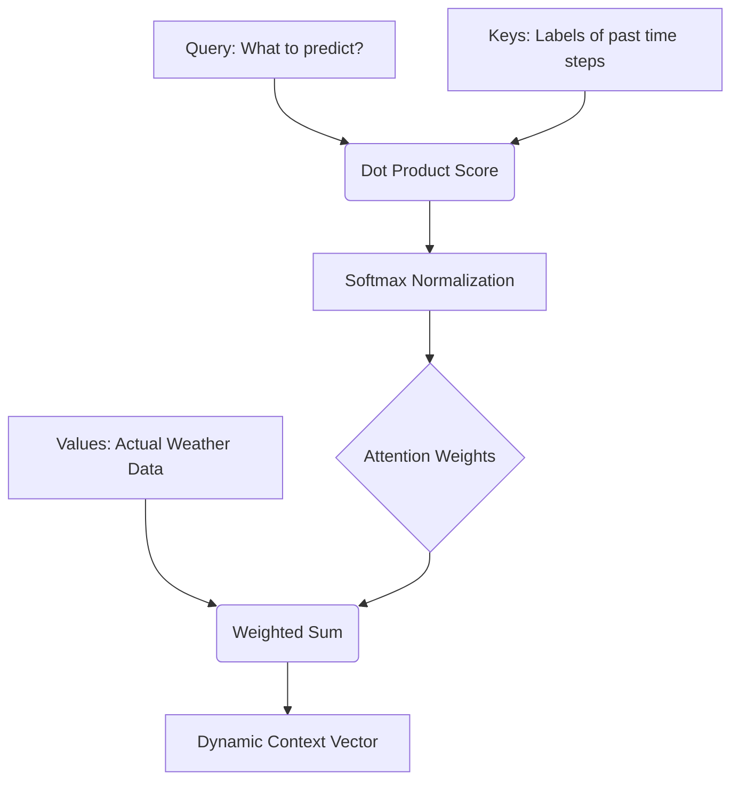

## 6.1 The Attention Mechanism
The fundamental limitation of any standard RNN or GRU is the **bottleneck constraint**. It must compress the entire historical sequence (e.g., 24 hours of complex weather data) into a single, fixed-size "thought vector" before making a prediction. For long sequences, it inevitably "forgets" details from the beginning.

**The Attention Mechanism** allows the model to dynamically look back at the *entire* historical sequence at every step of the prediction process and calculate which specific historical time steps are most relevant to the current prediction.

By computing a "similarity score" between a **Query** (what the model is trying to predict now) and all **Keys** (what's in its memory), it generates **Attention Weights**. These weights (e.g., "Pay 80% attention to the wind shear that occurred exactly 6 hours ago") are then used to create a weighted sum of the **Values**, forming a dynamic context vector that is highly relevant to the current prediction.