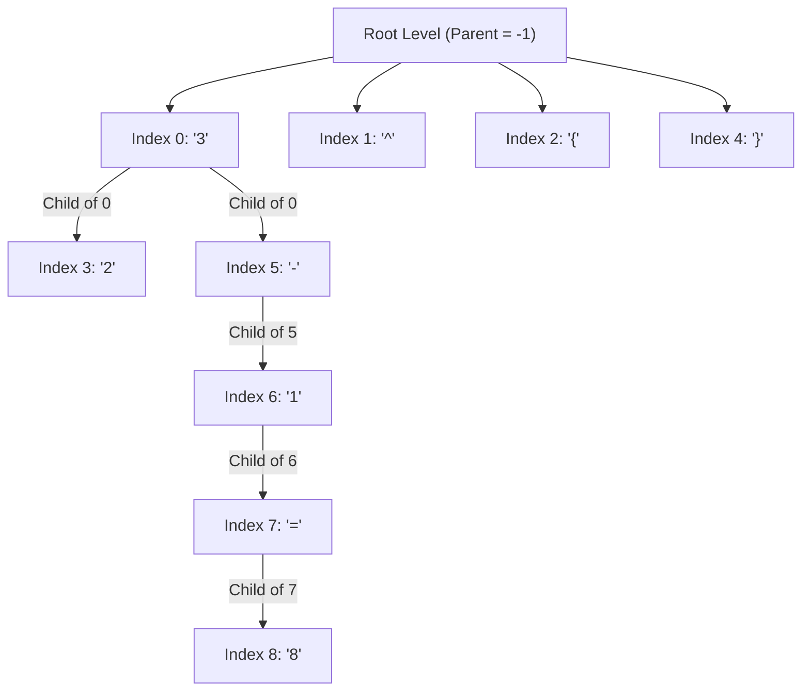

# 1.3 Tokenization and Mathematical Grammar

Before a neural network can process math, the image features must be mapped to discrete semantic units called **tokens**, and these tokens must follow the rules of mathematical grammar.

## 🔤 Tokenization Strategy

In HMER, tokenization must respect LaTeX commands rather than just individual characters. For example, the formula $\frac { x ^ { 2 } } { y + 1 }$ is tokenized into a vocabulary array:

`['\frac', '{', 'x', '^', '{', '2', '}', '}', '{', 'y', '+', '1', '}']`

### Special Tokens
A robust vocabulary requires structural tokens to manage sequence boundaries:
1.  **`<sos>` (Start of Sequence):** Signals the decoder to begin generating.
2.  **`<eos>` (End of Sequence):** Signals the completion of the formula.
3.  **`<pad>` (Padding):** Ensures all sequences in a training batch are the same length for efficient matrix multiplication.
4.  **`<unk>` (Unknown):** Catches out-of-vocabulary symbols.

## 🌳 AST and Parent-Child Relationships

To train the Tree-Aware module, we map every token to its "parent" in an **Abstract Syntax Tree (AST)**.

*   **Logic:** In $x ^ 2$, `x` is the base, `^` modifies `x`, and `2` is the child of `^`.
*   During data preparation, an algorithm explicitly assigns a `parent_index` (the position of the parent token in the sequence) to every content token.

### Detailed Example: $3^2 - 1 = 8$
The LaTeX string: `3 ^ { 2 } - 1 = 8`
Indices:
0: `3`, 1: `^`, 2: `{`, 3: `2`, 4: `}`, 5: `-`, 6: `1`, 7: `=`, 8: `8`

**Parent-Child Mapping:**
`{(3, 0), (5, 0), (6, 5), (7, 6), (8, 7)}`
*(Note: A parent index of -1 signifies a root-level node)*

⚠️ **Common Pitfall:** Students often forget to exclude `<pad>`, `<sos>`, and `<eos>` from tree construction. Structural trees only apply to mathematical content tokens.
