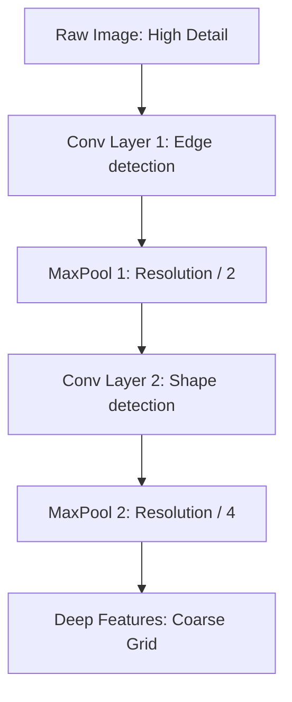

# 2.1 CNNs and the Spatial Precision Problem

In the early days of Math OCR (and in many "vibe-coded" tutorials you might find online), **Convolutional Neural Networks (CNNs)** like ResNet-50 or VGG were the standard choice for the encoder. While CNNs are excellent for general object recognition (like identifying a cat or a dog), they have a fundamental weakness when it comes to mathematics.

##  How CNNs Work: The Pooling Problem
CNNs use a technique called **Pooling** (e.g., MaxPool) to reduce the resolution of an image as it goes deeper into the network.
*   **Goal:** To make the model "invariant" to small shifts. If a cat moves 5 pixels to the left, the CNN still sees a cat.
*   **Method:** It averages or takes the maximum value in a small window (e.g., $2 \times 2$), effectively throwing away half of the spatial detail.

###  The Math Conflict
In math, **spatial precision is everything**.
*   Is that a dot for a multiplication ($\cdot$) or just a speck of noise?
*   Is that a minus sign ($-$) or the bar of a fraction ($\frac{\dots}{\dots}$)?
*   Is the '2' a base ($x2$) or a superscript ($x^2$)?

When a CNN pools an image several times, it loses the exact coordinates of these small symbols. By the time the features reach the decoder, the "2" in $x^2$ might be blurred into the same feature map as the "x", making it impossible to tell them apart.

##  Visualizing the "Blurred Math"
Imagine a high-resolution image of $\frac{a}{b}$.

At the **Deep Features** stage, the fraction bar and the characters 'a' and 'b' might occupy the same "cell" in the model's memory. This is called **Feature Overlap**.

##  The DenseNet Solution (Previous improvement)
To fix this, some researchers moved to **DenseNet**. DenseNet connects *every layer to every other subsequent layer* within a dense block. 

*   **Forward Pass:** $x_l = H_l([x_0, x_1, ..., x_{l-1}])$
*   **Feature Reuse:** This architecture encourages feature reuse and prevents the vanishing gradient problem, making it excellent for reading faint handwriting strokes.
*   **Implementation in your code:** You'll notice a `DenseNetEncoder` class in your notebook. This is better than ResNet, but still relies on convolutions, which have a limited "receptive field" (they can only see a small area at a time).

##  The Real Breakthrough: Transformers in Vision
The modern approach (and what TAMER uses) is to replace CNNs entirely with **Vision Transformers (ViT)** or **Swin Transformers**.

*   **Why?** Transformers use **Attention**, which allows any part of the image to "talk" to any other part without losing precision through pooling.
*   Instead of blurring the image, they divide it into **Patches** and treat each patch as a token, preserving its exact position.

---
> [!IMPORTANT]
> **Key Background:** **Invariant vs. Equivariant**. CNNs are designed to be *invariant* (ignore small position changes), but math recognition needs to be *equivariant* (sensitive to position changes).

> [!TIP]
> **Students Often Miss:** The fact that math is much "sparser" than natural images. A huge whitespace between symbols actually carries meaning. CNNs often treat whitespace as "empty noise" and discard it, whereas Transformers can attend to the *lack* of symbols to understand layout.
