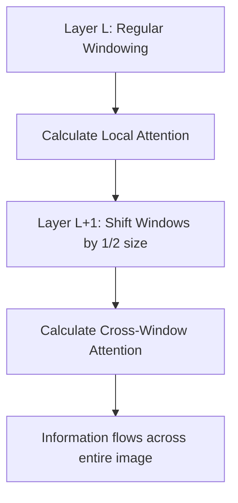

# 2.2 Swin Transformer V2

If a standard Vision Transformer is like an eye looking at a whole scene at once, a **Swin Transformer** (Shifted Window Transformer) is like an eye scanning a page line by line, but with the ability to see connections across windows.

##  Why "Swin"?
The name comes from **S**hifted **Win**dows. This architecture was designed specifically to bridge the gap between CNNs (which are efficient but "local") and Transformers (which are powerful but "global").

###  1. Hierarchical Architecture
Unlike a standard ViT, which processes images as a flat list of fixed-size patches, a Swin Transformer starts with small patches and gradually merges them into larger ones, just like a CNN's hierarchy (e.g., edges $\rightarrow$ shapes $\rightarrow$ objects).
*   **Layer 1:** Looks at $4 \times 4$ pixels.
*   **Layer 2:** Merges $2 \times 2$ adjacent patches into $8 \times 8$.
*   **Layer 3:** Further merges into $16 \times 16$.

**Why it matters for Math:** Math symbols vary wildly in size. A tiny subscript and a giant summation ($\sum$) or fraction bar need different "zoom levels". This hierarchical approach handles that perfectly.

###  2. Window-based Attention
Instead of calculating attention across the *entire* image (which takes $O(\text{Pixels}^2)$ complexity), Swin calculates attention only within small windows (e.g., $7 \times 7$ patches).
*   **Benefit:** It's incredibly fast and efficient. It can handle high-resolution images where a standard Transformer would run out of memory.

###  3. Shifted Windowing (The "Secret Sauce")
Calculating attention *only* inside windows means that a symbol on the edge of Window A couldn't "see" a symbol on the edge of Window B. To fix this, Swin **shifts** the window grid in alternating layers.

This allows the model to understand that the "x" in Window 1 and the "^2" in Window 2 are part of the same expression $x^2$.

##  Improvements in V2 (The "Enhanced" part of your project)
You'll notice your code uses **Swin-V2**. Here are the two key technical differences that make it better for math:

1.  **Post-Normalization (Post-Norm):** In V1, the model normalized features *before* attention. In V2, it does it *after*. This makes training much more stable, especially when you have deep layers and small batches (like in Colab).
2.  **Log-spaced Relative Position Bias:** Math symbols are often far apart but logically linked. Swin-V2 incorporates a **Relative Positional Bias** matrix directly into the attention calculation:
    $$Attention(Q, K, V) = \text{SoftMax}\left(\frac{QK^T}{\sqrt{d}} + B\right)V$$
    Where $B$ is a learnable matrix representing the relative 2D distance between patch $i$ and patch $j$.

---
##  Reasoning: Why did we pick Swin-V2 for TAMER?
Standard OCR models use CNNs because they are fast. But in HMER, we need the "Global Reasoning" of a Transformer to know that a tiny dot 100 pixels away is actually the end of a long complex proof. **Swin-V2 gives us the speed of a CNN with the global "IQ" of a Transformer.**

> [!IMPORTANT]
> **Key Term: Patch Merging**. This is the process of concatenating $2 \times 2$ neighboring patches and reducing their dimensionality. It is the "Transformer equivalent" of a CNN's Pooling layer, but much more sophisticated.

> [!TIP]
> **Points Students Often Miss:** The "Shifted Window" is NOT the same as a "Sliding Window" in a CNN. A CNN slides across every pixel; Swin stays in its window for one layer and then shifts the *grid* for the next. This is what makes it computationally efficient ($O(N)$ vs $O(N^2)$).
