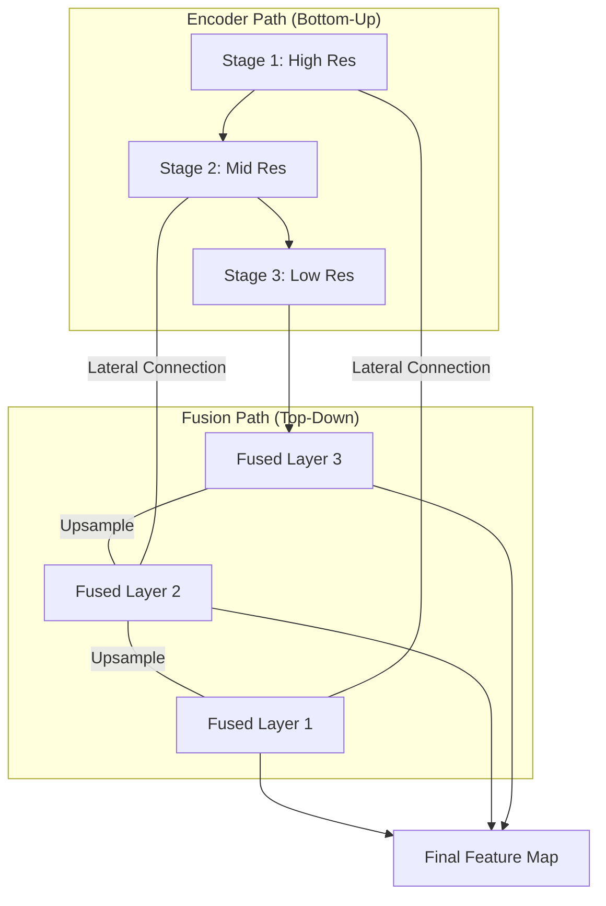

# 2.3 Feature Pyramid Networks and Fusion

In Chapter 2.2, we saw how the Swin Transformer creates a "Hierarchy" of features, from small patches to large windowed regions. But how does the model actually *use* all those different levels of detail at the same time? The answer lies in **Feature Pyramid Networks (FPN)** and **Multi-Scale Fusion**.

##  Why do we need Multi-Scale features?
In a mathematical expression, symbols are not uniform.
*   **Small scale:** Dots in $i$, minus signs $-$, and superscripts $x^2$. These require high-resolution features from early layers.
*   **Large scale:** Huge integral signs $\int$, summations $\sum$, and long fraction bars $\frac{\dots}{\dots}$. These require low-resolution, high-context features from deep layers.

If we only use the *last* layer of the encoder, we might lose the "dots" and "minus signs". If we only use the *first* layer, we won't understand the overall structure of the proof.

##  The FPN (Feature Pyramid Network) Logic
FPN is a architecture that combines deep, high-level semantic features with shallow, low-level spatial features.



### 1. Lateral Connections
These are like "shortcuts". They allow the model to take a high-resolution edge map from Stage 1 and "glue" it onto the semantic context from the deeper layers.

### 2. Top-Down Path
We take the most "meaningful" (but low-resolution) features from the bottom of the encoder and **upsample** them so they match the resolution of the earlier layers.

##  The Fusion Process in your TAMER Project
In the `MultiScaleFusion` class of your notebook, the model performs the following steps:

1.  **Interpolation:** Deep features are resized (upsampled) to match a target size (e.g., $128 \times 256$).
2.  **Concatenation:** Features from all stages (S1, S2, S3) are "stacked" on top of each other.
3.  **1x1 Convolution:** A special compression layer is applied to "blend" these stacked features into a single, optimized feature map that the Decoder can understand.

```python
# From your imagetomath_merged.ipynb:
class MultiScaleFusion(nn.Module):
    def forward(self, multi_scale, target_size):
        # 1. Upsample all features to the same size
        fused = [F.interpolate(f, size=target_size) for f in multi_scale]
        # 2. Concatenate them together
        return self.fusion(torch.cat(fused, dim=1))
```

##  Reasoning: Why not just use one size?
Imagine you are looking at a puzzle. If you only look through a microscope (high detail), you can see the texture of one piece but don't know where it fits in the sky or the grass. If you only look from 10 feet away (high context), you can see it's a field but can't see the edges of the pieces. **Multi-Scale Fusion is like having both views at once.**

---
> [!IMPORTANT]
> **Key Concept: Semantic vs. Spatial**. "Deep" features are **Semantic** (they know *what* a concept is, like "this is a fraction"). "Shallow" features are **Spatial** (they know *where* an edge is). Math OCR needs both to avoid placing symbols in the wrong spot.

> [!TIP]
> **Students Often Miss:** The fact that fusion isn't just "adding" features; it's a careful balance. If you add too many shallow features, the model gets "confused" by noise (ink blurs). If you add too many deep features, it gets "lazy" and skips small details. The **Learnable Fusion Weights** in TAMER optimize this balance automatically.
