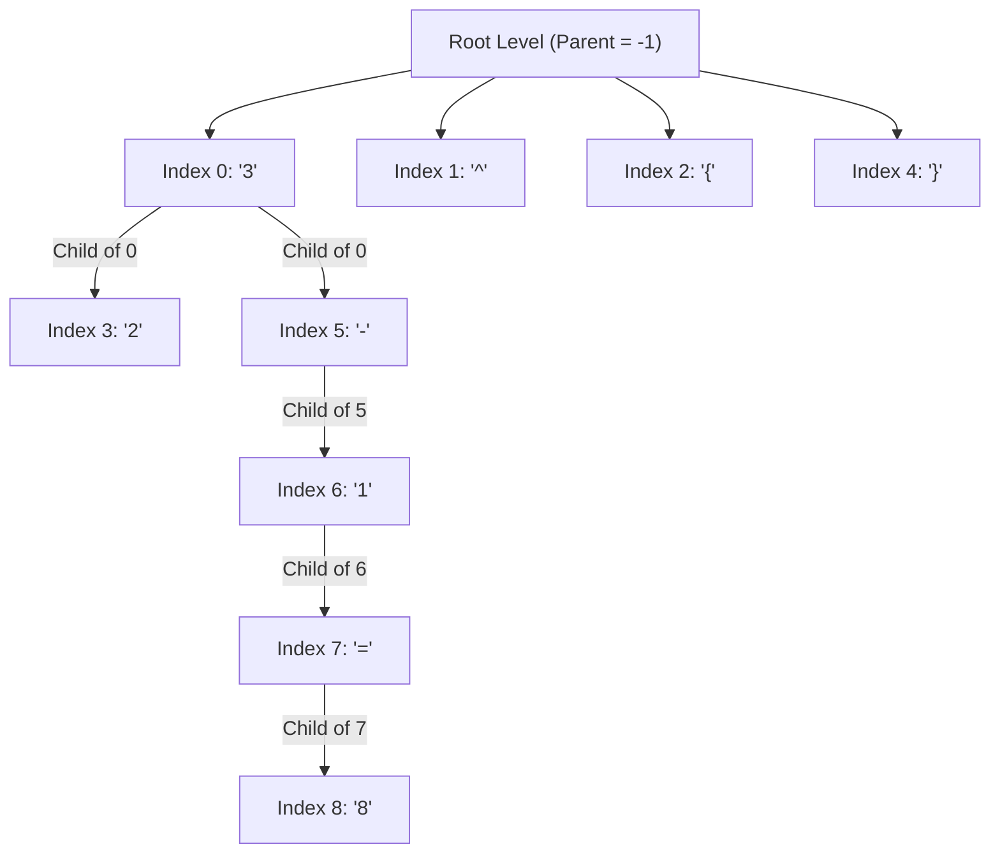

# 3.2 Tree Representation and Annotation

To move beyond simple sequences, we must define how a mathematical expression is represented as a tree. TAMER converts standard LaTeX sequences into **tree-structured annotation** using the index (position) of the symbols.

## 🏗️ The Conversion Process

Instead of using tokens themselves as identifiers, TAMER uses the **index** of the symbol in the LaTeX sequence. This eliminates ambiguity if a symbol appears multiple times.

*   **Logic:** The tree is represented as a series of tuples: **(Child Node Index, Parent Node Index)**.
*   **Root:** A parent index of **-1** signifies a root-level node.

## 📝 Example Walkthrough: $3^{2} - 1 = 8$

LaTeX tokens: `3 ^ { 2 } - 1 = 8`
Indices:
0: `3`, 1: `^`, 2: `{`, 3: `2`, 4: `}`, 5: `-`, 6: `1`, 7: `=`, 8: `8`

**Tree Structure Representation:**
`{(0, -1), (1, -1), (2, -1), (3, 0), (4, -1), (5, 0), (6, 5), (7, 6), (8, 7)}`

*   `(3, 0)`: Token 3 (`2`) is the child of token 0 (`3`) -> **Superscript relationship**.
*   `(5, 0)`: Token 5 (`-`) follows parent token 0 (`3`).

### 🌳 The Structural Graph

## 🧠 Why use Indices?

1.  **Duplicate Symbols:** Distinctly identifies multiple occurrences of the same character (e.g., $x + x$).
2.  **Structural Rigidity:** Ensures the model learns the exact geometric location of every character in the tree hierarchy.

---
> [!IMPORTANT]
> **Key Concept:** Formatting tokens like `{` and `}` are often root-level nodes in the annotation tree because they serve as boundaries rather than content children. The true mathematical child is the token *inside* the braces.
