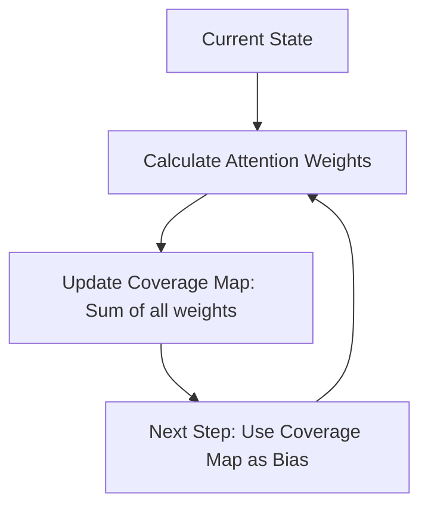

# 4.1 Cross-Attention and Coverage

The **Decoder** is the "voice" of the model. It takes the abstract visual features from the Encoder and translates them into a sequence of LaTeX characters. However, a standard Transformer Decoder often suffers from two problems in math: **Skipping** (missing a symbol) and **Repeating** (saying the same symbol twice). 

TAMER fixes this using **Coverage Attention**.

##  How the Decoder "Sees": Cross-Attention
In a standard Transformer, the Decoder uses **Cross-Attention** to look at the image features.
*   **Query ($Q$):** The current character the model is thinking about.
*   **Key ($K$):** The visual features from the image (Swin/DenseNet).
*   **Value ($V$):** The actual content of those visual features.

At each step, the model calculates a set of "Attention Weights" that tell it which parts of the image are relevant to the next character.

##  The "Missing Symbol" Problem
Because math expressions are often sparse (lots of white space and small dots), the attention mechanism can get confused. It might "forget" that it hasn't looked at a specific part of the image yet.
*   **Example:** In the expression $i = 1$, the model might recognize the "$i$", then jump straight to the "$=$", completely ignoring the tiny dot on top of the "i".

##  The Solution: Coverage Attention
**Coverage Attention** acts like a "memory map" of which parts of the image have already been processed.

###  How it works (The Logic)
1.  **Maintenance:** The model maintains a "Coverage Vector" ($\alpha$) which is the sum of all past attention weights.
2.  **Feeding Back:** In the next step, this coverage vector is fed back into the attention calculation.
3.  **Penalty:** If a region has a high coverage score, it means it has already been "read", so the model is penalized for looking there again. Conversely, regions with low coverage are "prioritized".



###  The Code Implementation
In your `imagetomath_merged.ipynb`, you'll see this in the `CoverageAttention` class:

```python
# new_coverage is the updated memory of what we've seen
new_coverage = coverage + attn_weights.sum(dim=2)

# During the next step, we use cov_bias to shift the attention
attn = attn + self.coverage_proj(self.coverage_conv(coverage))
```

##  Why this is essential for "Vibe-Coding" Fixes
If your model was previously outputting $f(x) = x 2$ instead of $f(x) = x^2$, or if it was missing minus signs, it's likely because the attention was "skipping" those small regions. **Coverage Attention ensures that every single pixel of ink is eventually accounted for.**

---
> [!IMPORTANT]
> **Key Concept: Attention Saturation.** High coverage leads to "saturation", forcing the model to move its eyes to a new, unnoticed part of the image.

> [!TIP]
> **Students Often Miss:** Coverage doesn't just prevent skipping; it also prevents **Hallucination**. If the model knows it has already read the whole image, it is much more likely to output an `<EOS>` (End of Sentence) token instead of making up random symbols at the end.
