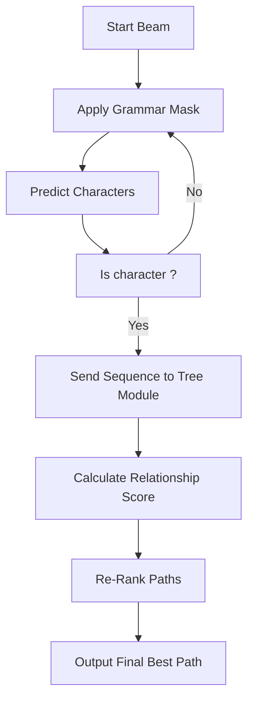

# 4.3 Constrained Beam Search

In Chapter 3.3 and 4.2, we discussed the "Scoring" and the "Masking" independently. **Constrained Beam Search** is the algorithm that brings them both together into a single, high-performance recognition cycle.

##  What is Beam Search?
When a model predicts a character, it doesn't just pick the top one. It keeps track of a "Beam" of the top $K$ (e.g., 5 or 10) most likely sequences.
*   **Step 1:** Model starts with `<SOS>`.
*   **Step 2:** Predicts five most likely characters (e.g., `x`, `\frac`, `3`, `y`, `(`).
*   **Step 3:** For each of those five, it predicts the next five characters.
*   **Step 4:** It keeps the overall "Top 5" paths and discards the rest.

##  Adding the "Constraints"
In TAMER, standard Beam Search is modified by **Masking** and **Structural Scoring**.

###  The Constrained Recognition Cycle
For each step in the beam:

1.  **Grammar Masking:** The model checks 4.2's constraints. It blocks any tokens that would make the LaTeX invalid.
2.  **Probability Calculation:** The Decoder predicts the next token from the "Allowed list".
3.  **Beam Updating:** The paths are updated as usual.
4.  **Structural Scoring (Final Step):** Once the beam reaches the `<EOS>` token, the **Tree-Aware Module (TAM)** (3.2) calculates the Parent-Child Relationship Score for each candidate.
5.  **Re-Ranking:** The candidates are sorted by their **Combined Score** (Sequence + Tree).

##  Avoiding "Looping" and "Vanishing" Expressions
A major problem in long mathematical formulas is that the model might get stuck in an "Infinite Bracket Loop": `\sqrt { \sqrt { \sqrt { ...`
Constrained Beam Search prevents this by:
*   Setting a **Maximum Sequence Length** (e.g., 200 tokens).
*   Increasing the penalty for structural complexity as the sequence grows longer.

##  The Logic: Synthesis
By the time the model outputs your result, it has passed through **three distinct filters**:
1.  **Visual Evidence:** What did the Swin Transformer see?
2.  **Grammar Law:** Is the LaTeX mathematically valid?
3.  **Structural Rationality:** Does the tree relationship make sense?

---
> [!IMPORTANT]
> **Essential Background:** Beam Search is a "Heuristic Search". It doesn't guarantee the mathematically optimal result, but it is much faster than an exhaustive search and much more accurate than a simple "Greedy Search" (picking only the single top character).

> [!TIP]
> **Points Students Often Miss:** The "K" in Beam Search (the beam width) is a trade-off.
> *   Small K (e.g., 1): Very fast, but easy to make early mistakes.
> *   Large K (e.g., 20): Very slow, but can recover from early mistakes.
> **TAMER works best with K ≈ 5** because the Tree Scoring is powerful enough to fix most errors even with a narrow beam.
