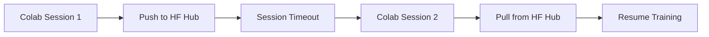

# 7.2 Cloud Integration and Hardware Limits

Free cloud providers (like Google Colab) limit GPU sessions to a few hours. To train a heavy model like TAMER, developers often use multi-session training across rotated accounts.

##  Bypassing Limits with Hugging Face

By utilizing the `huggingface_hub` API, the training script can automatically push the `.pth` checkpoint and the `training_log.json` to a private cloud repository at the end of each epoch.

### The Workflow
1.  **Authentication:** Authenticate with your HF Token at the start of the session.
2.  **Auto-Pull:** On boot, the script checks the Hub and pulls the latest available checkpoint.
3.  **Auto-Push:** After every epoch, the script "commits" the new checkpoint to the hub.

##  Why Hugging Face?
*   **Git LFS:** Designed to handle large binary files (weights).
*   **Privacy:** Private repos keep your research weights secure.
*   **Reliability:** Centralized storage is much more reliable than temporary cloud drives or local disk.

---
> [!TIP]
> **Pro Tip:** Use the `Repository` class from `huggingface_hub` to manage local clones and automated pushes with a few lines of Python.
