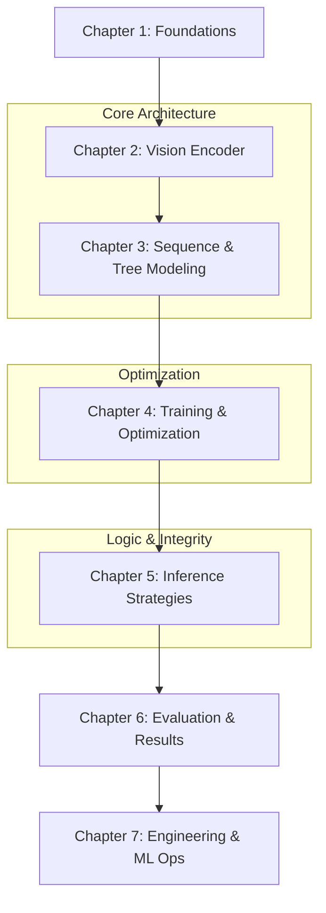

# TAMER: Tree-Aware Transformer Course Roadmap

Welcome to the **TAMER (Tree-Aware Transformer for Handwritten Mathematical Expression Recognition)** comprehensive course. This vault is designed to take you from "vibe-coding" to a deep, rigorous understanding of the theory, mathematics, and implementation behind modern Math OCR.

##  Course Objective
To master the end-to-end pipeline of recognizing handwritten mathematical expressions, moving beyond simple sequence models to structural, tree-aware architectures that ensure syntactic correctness.

##  Learning Path

##  Vault Structure
The course is organized into seven logical chapters, providing a coherent and actionable learning path.

### [Chapter 1: Foundations of Mathematical OCR](1.1%20HMER%20Overview%20and%20Challenges.md)
Understand the history of OCR, why math is "harder" than text, and the high-level philosophy of the TAMER architecture.

### [Chapter 2: Vision Encoders and Feature Extraction](2.1%20CNNs%20and%20Spatial%20Precision.md)
Deep dive into the "eyes" of the model. Compare CNNs with the modern Swin Transformer V2 and understand how Feature Pyramid Networks (FPN) fuse multi-scale information.

### [Chapter 3: Sequence Modeling and Hierarchical Structures](3.1%20Transformer%20Decoder%20Fundamentals.md)
The heart of TAMER. Learn how mathematical expressions are represented as parent-child relationship trees and how the Tree-Aware Module (TAM) predicts these structures.

### [Chapter 4: Training and Joint Optimization](4.1%20Joint%20Loss%20Functions.md)
The "how-to" of training. Covering joint loss functions, data augmentation (Affine/Elastic), two-stage pretraining (printed to handwritten), and curriculum learning.

### [Chapter 5: Advanced Inference and Decoding Strategies](5.1%20Beam%20Search%20and%20Greedy%20Decoding.md)
Explore Beam Search, the Tree-Based Structural Scoring mechanism, and how LaTeX grammar constraints are enforced during inference.

### [Chapter 6: Experiments and Results](6.1%20Datasets%20and%20Evaluation%20Metrics.md)
How do we know if it's working? Learn about ExpRate metrics, structural complexity analysis, and ablation studies.

### [Chapter 7: Engineering ML Ops and External Tools](./Chapter%207/7.1%20Checkpointing%20and%20Persistence.md)
Practical engineering for long training sessions. Covering robust checkpointing, Hugging Face Hub integration, and dynamic environment configuration for external CV tools (COLMAP).

---
> [!TIP]
> This vault was generated by synthesizing your project's code, technical notes, and the original TAMER research paper. It resolves previous ambiguities and provides a coherent, logical flow for mastery.
