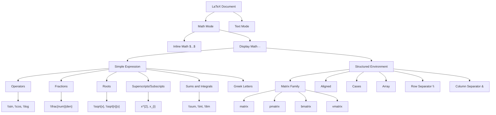

# 1. LaTeX Syntax Primer

Understanding LaTeX is **absolutely essential** for working with the TAMER OCR project, because LaTeX is the target language the model produces. Every image of a mathematical expression that enters the model exits as a sequence of LaTeX tokens. If you do not understand what those tokens mean, you cannot evaluate the model, debug its errors, or appreciate the design decisions that went into its architecture and loss functions. This chapter provides a comprehensive introduction to LaTeX syntax as it relates to mathematical typesetting and, specifically, to the output space of the TAMER model.

## What Is LaTeX?

LaTeX (pronounced "LAY-teck" or "LAH-teck") is a document preparation system built on top of the TeX typesetting engine created by Donald Knuth in the late 1970s. While TeX provides low-level typesetting commands, LaTeX wraps them in a higher-level markup language designed for producing professional-quality scientific and mathematical documents. In the context of OCR, we care almost exclusively about LaTeX's **math mode**, which is the subsystem that renders mathematical formulas.

A LaTeX document is plain text containing commands that begin with a backslash (`\`). When processed by a LaTeX engine (such as pdflatex, xelatex, or the JavaScript-based KaTeX/MathJax used in web rendering), these commands produce beautifully typeset output. The crucial insight for OCR is that the **same visual rendering can often be produced by different LaTeX source strings**, and conversely, **small changes in LaTeX source can produce dramatically different visual output**. This asymmetry is what makes LaTeX OCR fundamentally harder than plain-text OCR.

## Basic LaTeX Math Syntax

### Inline and Display Math

LaTeX distinguishes between two modes of mathematical expression:

- **Inline math** is enclosed in single dollar signs: `$E = mc^{2}$`. This renders the formula within a line of text, with compressed fractions and smaller symbols to fit the surrounding text baseline.
- **Display math** is enclosed in double dollar signs: `$$E = mc^{2}$$`. This renders the formula on its own centered line, with full-size fractions and larger operators.

The TAMER model treats the entire LaTeX string as a flat sequence of tokens; it does not explicitly distinguish between inline and display math modes at the architectural level. However, the training data contains both, and the model learns to generate the appropriate delimiters.

### Greek Letters

Greek letters are among the most frequently occurring tokens in mathematical LaTeX. They are invoked with a backslash followed by the English name of the letter:

| Token | Symbol | Token | Symbol |
|-------|--------|-------|--------|
| `\alpha` | α | `\beta` | β |
| `\gamma` | γ | `\delta` | δ |
| `\theta` | θ | `\lambda` | λ |
| `\mu` | μ | `\pi` | π |
| `\sigma` | σ | `\omega` | ω |
| `\phi` | φ | `\psi` | ψ |

Uppercase variants use a capital first letter: `\Delta` → Δ, `\Sigma` → Σ, `\Omega` → Ω. Some letters have variant forms, such as `\epsilon` vs `\varepsilon` and `\phi` vs `\varphi`. These variant distinctions matter for OCR because they are visually distinct but semantically similar, creating natural ambiguity in the training data.

### Operators and Fractions

The fraction operator `\frac{numerator}{denominator}` is one of the most important LaTeX constructs. It takes two mandatory arguments enclosed in braces and renders them as a stacked fraction with a horizontal bar. For example, `\frac{a+b}{c-d}` renders as (a+b) over (c-d) with a horizontal bar between them.

Square roots use `\sqrt{x}` for a simple radical and `\sqrt[n]{x}` for an nth root. The `[n]` optional argument specifies the root index. Other critical operators include:

- `\sin`, `\cos`, `\tan`, `\log`, `\ln`, `\exp` — named functions rendered in upright text
- `\cdot` — centered dot for multiplication
- `\times` — multiplication cross
- `\div` — division sign
- `\pm` — plus-minus sign
- `\neq` — not equal
- `\leq`, `\geq` — less-than-or-equal, greater-than-or-equal
- `\approx`, `\equiv` — approximately equal, equivalent to

### Superscripts and Subscripts

Superscripts use the caret (`^`) and subscripts use the underscore (`_`). When the content is a single character, braces are optional: `x^2` and `x^{2}` are equivalent. For multi-character content, braces are mandatory: `x^{10}` produces x to the power 10, while `x^10` produces x to the power 1 followed by a literal 0. Both superscripts and subscripts can be applied simultaneously: `x_{i}^{2}` produces x-subscript-i-superscript-2.

Nesting is common in mathematical notation: `e^{x^{2}}` produces e to the power x-squared. Deep nesting like `2^{2^{2^{2}}}` creates a tower of superscripts. The TAMER model must learn to correctly open and close braces at every nesting level, which is one of the most error-prone aspects of generation.

### Sums, Integrals, and Limits

Large operators have special rendering rules that distinguish them from ordinary symbols:

```latex
\sum_{i=1}^{n} a_i       % Sum with sub/superscript limits
\prod_{j=0}^{k} b_j      % Product
\int_{0}^{\infty} f(x)\,dx   % Definite integral
\lim_{x \to \infty} g(x)     % Limit
```

In display mode, the subscripts and superscripts on large operators are rendered directly above and below the operator symbol. In inline mode, they appear to the side. This two-dimensional behavior is part of what makes math OCR so challenging: the same LaTeX source can produce different visual layouts depending on the rendering context.

The `\to` command (alias `\rightarrow`) produces the right arrow used in limits. Other arrows include `\gets` (←), `\Rightarrow` (⇒), and `\Leftrightarrow` (⇔).

## Structural LaTeX

This section covers the LaTeX constructs that define **spatial structure** — the arrangement of elements in rows, columns, and nested layouts. These constructs are particularly important for the TAMER project because the **structure-aware loss function** applies higher penalties to errors in structural tokens (like `\\`, `&`, `\begin`, `\end`) than to errors in ordinary content tokens.

### Row and Column Separators

- **`\\` (double backslash)** separates rows in a matrix, aligned equation, or cases environment. It tells the renderer to start a new line.
- **`&` (ampersand)** separates columns (or alignment points) within a row. In aligned environments, it marks where equations should line up.

These two tokens are among the most critical in the entire vocabulary. A missing `\\` can collapse a 3x3 matrix into a single garbled row. A missing `&` can destroy the alignment of a system of equations. The structure-aware loss in TAMER explicitly upweights these tokens to ensure the model prioritizes getting them right.

### Matrix Environments

```latex
\begin{matrix} a & b \\ c & d \end{matrix}
```

This produces a plain 2x2 matrix without delimiters. Variants add different brackets:

| Environment | Delimiters |
|------------|-----------|
| `matrix` | None |
| `pmatrix` | Parentheses ( ) |
| `bmatrix` | Square brackets [ ] |
| `Bmatrix` | Curly braces { } |
| `vmatrix` | Vertical bars \| \| |
| `Vmatrix` | Double vertical bars ‖ ‖ |

Each of these environments uses the same internal syntax (entries separated by `&`, rows separated by `\\`) but wraps the result in different delimiters. The model must learn not just the internal structure but also the correct environment name.

### Aligned Environments

The `aligned` environment (used inside display math) aligns multiple equations at a specified point, typically an equals sign:

```latex
\begin{aligned}
  f(x) &= x^{2} + 2x + 1 \\
       &= (x+1)^{2}
\end{aligned}
```

The `&` before each `=` marks the alignment point. All `=` signs in different rows will line up vertically. This is extremely common in mathematical derivations, and the model encounters it frequently in the training data.

### Cases and Other Structured Environments

The `cases` environment is used for piecewise function definitions:

```latex
f(x) = \begin{cases}
  x^{2} & \text{if } x \geq 0 \\
  -x^{2} & \text{if } x < 0
\end{cases}
```

Each row contains the expression followed by `&` and then the condition. The environment renders a large left curly brace spanning all rows.

Other important environments include:

- **`array`**: A general-purpose tabular environment that supports column alignment specifiers (like `r`, `c`, `l` for right, center, left). More flexible than matrix environments but rarely used in the TAMER training data.
- **`eqnarray`**: An older alignment environment, now largely superseded by `aligned`. Still appears in legacy LaTeX documents.
- **`subequations`**: Groups equations with sub-numbering (e.g., 1a, 1b, 1c).

## How LaTeX Maps to Visual Rendering

The relationship between LaTeX source and its visual rendering is **not trivial**. A LaTeX engine parses the source, constructs a box model (measuring widths, heights, and depths of each element), and then lays out the elements according to the rules of the environment. Key aspects of this mapping include:

1. **Horizontal spacing** is mostly automatic in LaTeX. The engine inserts thin spaces after commas, medium spaces around binary operators, and thick spaces around relational operators. Explicit spacing commands like `\,` (thin), `\;` (medium), `\quad`, and `\qquad` override defaults.
2. **Vertical stacking** occurs in fractions, matrices, and aligned environments. The engine calculates the height of the numerator and denominator, adds spacing, and centers the fraction bar.
3. **Delimiter sizing** uses `\left` and `\right` to automatically scale parentheses, brackets, and braces to fit their content. For example, `\left(\frac{a}{b}\right)` produces tall parentheses that enclose the entire fraction.
4. **Font changes** between math italic (default for variables), upright (for operators and function names), and bold (for vectors and matrices) are handled by commands like `\mathbf`, `\mathrm`, and `\mathcal`.

Understanding this mapping is crucial because the TAMER model must invert it: given the visual rendering (a pixel image), it must produce the LaTeX source that would generate that rendering. Errors in the model's output are often understandable as confusion about which LaTeX construct produced a particular visual feature.

## Common LaTeX Patterns in the Training Data

The four datasets used to train TAMER (CROHME, Im2LaTeX, 100k LaTeX formulas, and a custom dataset) contain distinct patterns:

- **CROHME** is dominated by handwritten inline expressions with simple operators, Greek letters, and occasional fractions. Matrices and aligned environments are rare.
- **Im2LaTeX** contains rendered LaTeX from arXiv papers, featuring complex multi-line equations with aligned environments, nested fractions, and dense notation.
- **The 100k formulas** dataset spans a wide range of complexity, from single symbols to full derivations.
- **The custom dataset** fills gaps with specific structural patterns like matrices and cases.

The most common patterns include: simple inline expressions (`$a + b = c$`), fractions (both simple and nested), square roots, summations with limits, integrals, Greek-letter expressions, and aligned multi-line equations.

## Why Understanding LaTeX Matters for Model Output

The TAMER model does not output an image — it outputs a **string of LaTeX tokens**. To evaluate whether the model is correct, you must:

1. **Parse** the output string as valid LaTeX (or detect syntax errors).
2. **Render** both the ground-truth and predicted LaTeX to visual images.
3. **Compare** the rendered outputs visually or via structural matching.

Without understanding LaTeX syntax, you cannot tell whether `\frac{a}{b+c}` and `\frac{a}{b}+c` are different (they are — the first has b+c in the denominator, the second has only b), or whether `x^{10}` and `x^{1}0` are different (they are — the first is x to the 10th power, the second is x to the 1st power followed by a 0). These subtle distinctions in braces, delimiters, and structure are exactly where the model most often fails, and they are the focus of the structure-aware loss function.

## LaTeX Structure Hierarchy

The following Mermaid diagram illustrates how LaTeX constructs nest and relate to each other, from the outermost document level down to individual symbols:



This hierarchy is important because errors at higher levels (forgetting to close an environment, misplacing a row separator) cascade downward and corrupt everything that follows. The structure-aware loss in TAMER is designed precisely to teach the model that these high-level structural tokens carry disproportionate importance and must be generated with extra care.
