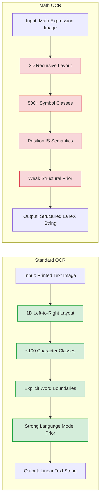

# 2. The OCR Problem and Why Math Is Hard

Optical Character Recognition is one of the oldest problems in computer vision, with roots stretching back to the 1910s when Emanuel Goldberg built early devices to read characters for telecommunications. Modern digital OCR became feasible in the 1950s and has since matured into a technology that most people use daily without thinking about it — when you deposit a check by photographing it, when your phone extracts text from a sign, or when a PDF reader makes a scanned document searchable, OCR is working behind the scenes. Yet despite decades of progress on recognizing printed text, recognizing **mathematical expressions** in images remains a fiendishly difficult open problem. This chapter explains what OCR is, why standard OCR works well for English text, and why mathematical OCR presents challenges of an entirely different magnitude.

## What Is OCR?

**Optical Character Recognition (OCR)** is the process of converting images of typed, handwritten, or printed text into machine-encoded text. Given a photograph or scan containing text, an OCR system identifies the characters, their order, and their arrangement, producing a digital text representation that can be searched, edited, and processed by computers.

At a high level, an OCR pipeline typically involves:

1. **Image acquisition and preprocessing**: Capture the image, correct for skew and rotation, adjust contrast, and binarize (convert to black and white).
2. **Text detection / segmentation**: Identify regions of the image that contain text, separating them from backgrounds, illustrations, and noise.
3. **Character recognition**: Classify individual characters or groups of characters using pattern matching or machine learning.
4. **Post-processing**: Apply language models, dictionary lookups, and heuristic rules to correct recognition errors (e.g., replacing "rn" with "m" where contextually appropriate).

For standard printed English text, this pipeline is remarkably effective. Commercial OCR engines like Tesseract, ABBYY FineReader, and Google Cloud Vision routinely achieve character-level accuracy above 99% on clean printed documents. The problem is essentially **solved** for this constrained setting.

## Standard OCR: Recognizing Printed Text

Standard OCR benefits from several properties of natural language text that make the problem tractable:

**Linear layout**: English text is read left-to-right, top-to-bottom. Characters are arranged in a single dominant direction on a one-dimensional baseline. Once you find the baseline, you know the reading order.

**Small alphabet**: There are only 26 letters (52 including uppercase), 10 digits, and a few dozen punctuation marks. The total vocabulary of characters is under 100, and many of these are visually quite distinct.

**Consistent spacing**: Words are separated by spaces, and characters within a word are arranged at roughly uniform intervals. This makes segmentation straightforward.

**Language model constraints**: English text follows statistical regularities. The sequence "th" is common; "qx" is not. A language model can dramatically reduce errors by preferring likely character sequences over unlikely ones. The constraint is powerful: for a 26-letter alphabet, a trigram language model reduces the effective per-character entropy from about 4.7 bits (uniform) to roughly 1.5 bits (natural English).

**Font invariance**: While different fonts look different, the underlying character identity is usually preserved. A well-trained classifier can learn features that generalize across fonts.

These properties mean that even a relatively simple pattern recognizer, combined with a language model, can achieve excellent performance on standard OCR tasks.

## Why Math OCR Is Much Harder

Mathematical expression recognition breaks nearly every assumption that makes standard OCR easy. Let us examine each source of difficulty in detail.

### Two-Dimensional Layout

This is the **single most important difference** between text OCR and math OCR. Mathematical notation is fundamentally two-dimensional. Subscripts sit below the baseline, superscripts float above it, fractions stack a numerator above a denominator with a horizontal bar between them, and matrices arrange entries in a grid. A simple expression like $x_{i}^{2}$ occupies three vertical levels simultaneously: the subscript level, the base level, and the superscript level.

Standard OCR assumes a one-dimensional reading order. You scan left to right, and you are done. In math, the reading order is recursive and context-dependent. You read the base symbol, then potentially the superscript (left to right), then the subscript (left to right), then any decorations like hats or tildes. A fraction requires reading the numerator left to right, then the denominator left to right. A matrix requires reading row by row, column by column, but the renderer must know the matrix dimensions to correctly interpret the spatial layout.

This two-dimensionality means that the spatial position of a symbol is not just stylistic — it is **semantic**. The number 2 positioned as a superscript means squaring; positioned as a subscript, it might be an index; positioned on the baseline, it is just the number two. The same pixel pattern at different vertical offsets carries completely different meaning.

### Symbol Variety

The English alphabet has 26 letters. Mathematical notation has **thousands** of symbols. The Comprehensive LaTeX Symbol List documents over 5,900 symbols across various packages. Even restricting to the most common math-mode symbols, the vocabulary easily exceeds 500 distinct glyphs. These include:

- Greek letters (lowercase and uppercase, plus variants like \varepsilon)
- Operators (\sum, \prod, \int, \oint, \bigcup, \bigcap)
- Relations (\leq, \geq, \subset, \supset, \cong, \sim)
- Arrows (\rightarrow, \Leftarrow, \mapsto, \hookrightarrow)
- Accents (\hat, \bar, \vec, \dot, \tilde)
- Variable-sized delimiters (\left, \right with parentheses, brackets, braces)
- Decorated letters (\mathbb{R}, \mathcal{L}, \mathbf{v})

This symbol variety creates a much larger classification space, and many symbols are **visually similar**: `\mid` (|) vs `\Vert` (‖), `\emptyset` (∅) vs `\varnothing` (∅ variant), `\times` (×) vs `\otimes` (⊗). Distinguishing these requires fine-grained visual discrimination that pushes the limits of even modern deep learning models.

### Structural Complexity

Mathematical expressions exhibit recursive, hierarchical structure. A fraction can contain a fraction in its numerator, which contains a square root, which contains a summation with limits, and so on. A matrix can contain expressions that themselves contain matrices. The nesting depth can be arbitrarily large, and the model must maintain an implicit "stack" of open environments to correctly generate closing tokens.

Consider this expression:

```latex
\frac{1}{\sqrt{2\pi}} \int_{-\infty}^{\infty} e^{-\frac{x^{2}}{2}} \, dx
```

This is a single line of LaTeX, but its visual rendering involves: a fraction (with 1 over a square root), inside the square root is 2π, an integral sign with lower limit -∞ and upper limit ∞, inside the integrand is an exponential of a negative fraction, inside that fraction is x² over 2. The nesting depth reaches four levels. The model must correctly predict every opening and closing brace, every `\begin` and `\end`, and every structural separator.

### Ambiguity

The same visual symbol can mean different things depending on context. A vertical bar | might be an absolute value delimiter, a conditional probability separator (as in P(A|B)), a divisibility indicator, or a set-builder notation separator. The letter e might be Euler's number (rendered upright in some conventions, italic in others) or just a variable. The string "sin" might be the sine function or the product of three variables s, i, and n.

This ambiguity means that **correct recognition often depends on understanding the broader context** — not just the pixels in a local region, but the structure of the entire expression. A model that only looks at local features will inevitably make ambiguous errors.

### Handwriting Variation

For handwritten math (as in the CROHME dataset), the challenges multiply. Every person writes mathematical symbols differently. Some people write their 1s with a serif, others without. Some draw their integral signs with a tight curl, others with an open sweep. The letter z can look identical to the number 2 in some handwriting styles. A plus sign + can look like the letter t or the letter x depending on how it is written.

This variation means the training distribution has extremely high variance for the same class label. A model must learn an incredibly flexible decision boundary to accommodate all the ways a symbol might appear while still distinguishing it from visually similar alternatives.

### No Explicit Spacing

In natural language, spaces between words provide a clear segmentation signal. In mathematical notation, **position IS the information**. There are no spaces between a variable and its superscript, but the superscript is semantically attached to the variable. A slight horizontal offset that would be meaningless in text OCR could be the difference between $x_n$ and $xn$ (subscript vs. multiplication by n) in math OCR.

This means the model cannot rely on whitespace as a segmentation cue. Instead, it must learn to parse the continuous spatial layout of the expression, inferring structural relationships from relative positions of symbols.

## The Image-to-Sequence Formulation

Given all these challenges, how do we formulate math OCR as a machine learning problem? The dominant approach is the **image-to-sequence** formulation: given an input image $X$ of a mathematical expression, produce an output sequence $Y = (y_1, y_2, \ldots, y_T)$ of LaTeX tokens. This is a **conditional sequence generation** problem.

This formulation is elegant because it sidesteps the need for explicit spatial parsing. Rather than requiring the model to first identify the structure (find the fraction bar, locate the superscripts, segment the matrix) and then transcribe each element, the image-to-sequence approach lets the model learn an **implicit** mapping from pixels to structured text. The structural knowledge emerges from the training data and model architecture rather than from hand-coded rules.

## Why Autoregressive Models Are Natural for This

Autoregressive models generate tokens one at a time, conditioning each new token on all previously generated tokens. This matches the natural reading order of LaTeX: you write the opening `\frac{` before the numerator, then the `}{` before the denominator, then the closing `}`. Each token depends on what came before — you would not write `}` unless you had previously opened an environment or group.

This left-to-right dependency structure is exactly what autoregressive models capture. The model learns that after generating `\frac{`, the next tokens should be the numerator followed by `}{`, then the denominator followed by `}`. It learns that after `\begin{matrix}`, rows should be separated by `\\` and entries by `&`, ending with `\end{matrix}`. The sequential generation naturally enforces the structural constraints of LaTeX.

## The Encoder-Decoder Advantage

The encoder-decoder architecture is particularly well-suited for image-to-sequence tasks because it cleanly separates two distinct cognitive demands:

- **The encoder** must "see" the entire image at once, building a holistic representation that captures both local features (what symbol is at this position) and global structure (how are the symbols arranged, what is the overall expression topology).
- **The decoder** must generate tokens sequentially, using the encoder's representation as context while maintaining its own state about what has been generated so far.

Without an encoder, a purely autoregressive model would have no way to "look at" the input image. Without a decoder, a purely encoding model would have no natural mechanism for sequential generation. The encoder-decoder split gives each component a clear role.

## Why CNN-Based Approaches Struggled

Early deep learning approaches to math OCR used CNN encoders to extract features from the input image and RNN decoders (typically LSTMs) to generate the output sequence. While these systems achieved reasonable results on simple expressions, they struggled with:

1. **Long-range dependencies**: A CNN's receptive field grows linearly with depth. To connect two symbols that are far apart in the image (say, the opening `\left(` and closing `\right)` of a large matrix), the network must be very deep or use dilated convolutions. Each layer adds parameters and computational cost.

2. **Variable-size inputs**: Mathematical expression images vary wildly in size — from a tiny inline fraction to a full-page derivation. CNNs require either fixed-size inputs or complex pooling strategies to handle this variation.

3. **RNN bottleneck**: LSTMs process their hidden state sequentially, making it difficult to "jump back" to an earlier part of the image representation when a later token requires information from a distant spatial location. The attention mechanism was introduced partly to address this, but even with attention, the CNN features themselves were limited in their spatial coverage.

## Why Transformers Excel

The Transformer architecture solves both the encoder and decoder limitations simultaneously:

1. **Self-attention** in the encoder connects every patch of the image to every other patch in a single layer, regardless of distance. The receptive field is **global** from layer one. This means the model can immediately learn relationships between symbols at opposite corners of the image, which is essential for correctly parsing large matrices or multi-line equations.

2. **Cross-attention** in the decoder allows each generated token to attend to any position in the encoder's representation. The model can "look at" whatever part of the image is most relevant for the current token, whether that is the fraction bar, a superscript, or a distant closing delimiter.

3. **Parallelism**: Unlike RNNs, Transformers process all positions in parallel during encoding, dramatically speeding up training.

4. **Scalability**: Transformers scale well with data and compute, and their performance improves predictably with model size — a property that has driven the success of large language models and that applies equally to vision-language models like TAMER.

## Standard OCR vs Math OCR Comparison



The green-highlighted boxes represent properties that make the problem tractable; the red-highlighted boxes represent properties that make it hard. Standard OCR enjoys nearly every tractable property, while math OCR faces nearly every hard one. This is why the TAMER project requires a sophisticated encoder-decoder architecture with structure-aware loss and curriculum learning — these design choices are direct responses to the fundamental difficulties outlined in this chapter.

Understanding these challenges is not merely academic. Every architectural decision in TAMER — from the choice of Swin Transformer v2 as the encoder (hierarchical features for multi-scale structure), to the custom LaTeX tokenizer (handling the large symbol vocabulary), to the structure-aware loss (upweighting critical structural tokens), to the curriculum learning strategy (starting with simple expressions before tackling complex ones) — is motivated by a specific difficulty described above. When you encounter a design choice in later chapters and wonder "why did they do it this way?", the answer almost always traces back to one of these fundamental properties of the math OCR problem.
