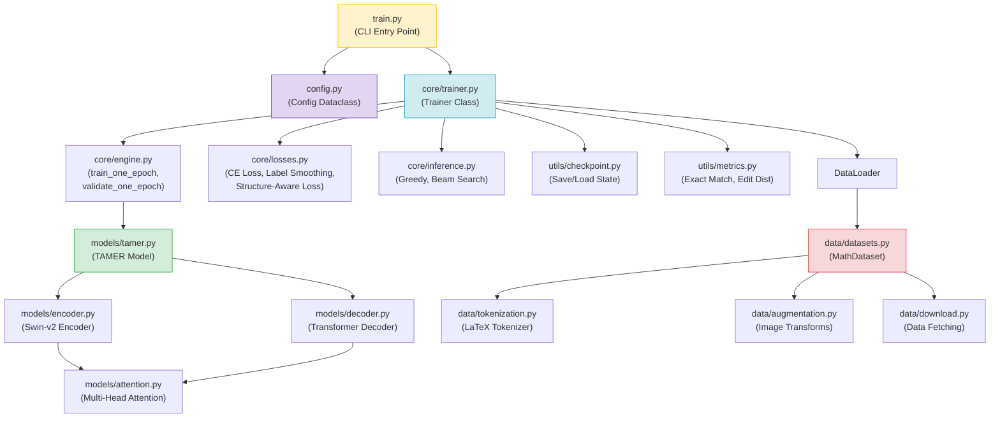

# 3. Python and Project Structure

Before diving into the mathematical and architectural details of the TAMER model, it is essential to understand the **physical codebase** — the directories, files, and Python patterns that make up the project. Knowing where code lives, how modules are organized, and what conventions the project follows will save you hours of confusion when you need to trace a bug from the training script to the loss function, or understand how configuration parameters flow from a YAML file to the optimizer. This chapter provides a comprehensive guide to the TAMER OCR project structure and the Python patterns it employs.

## The Project Directory Structure

The TAMER OCR project follows a standard Python package layout with a clear separation of concerns. At the top level, the project contains the main package directory, a training entry point, and configuration files. Here is the overall layout:

```
tamer-ocr/
├── tamer_ocr/              # The main Python package
│   ├── __init__.py         # Package marker with version
│   ├── config.py           # Centralized configuration
│   ├── logger.py           # Logging setup
│   ├── core/               # Training engine and orchestration
│   ├── data/               # Datasets, tokenization, augmentation
│   ├── models/             # Model architecture components
│   └── utils/              # Checkpointing, metrics, utilities
├── train.py                # CLI entry point for training
├── requirements.txt        # Python dependencies
└── README.md               # Project documentation
```

Each subdirectory within `tamer_ocr/` is a Python subpackage with its own `__init__.py`. The following sections describe each component in detail.

## The `tamer_ocr/core/` Subpackage — Training Engine

The `core/` subpackage is the **orchestration layer** of the project. It does not define the model architecture or the data pipeline directly; instead, it wires those components together and manages the training loop. The key files are:

- **`trainer.py`**: Contains the `Trainer` class, which is the heart of the training system. The `Trainer` is responsible for initializing the model, optimizer, and data loaders; running the training loop epoch by epoch; calling the loss functions; performing validation; and coordinating checkpoint saves. When you call `python train.py`, the `Trainer` is what actually runs.

- **`losses.py`**: Defines the loss functions used during training. This includes the standard cross-entropy loss, the label-smoothed cross-entropy loss, and critically, the **structure-aware loss** that applies higher weights to structural LaTeX tokens like `\\`, `&`, `\begin`, and `\end`. The structure-aware loss is one of TAMER's key innovations, and understanding its implementation here is essential.

- **`inference.py`**: Provides the inference pipeline for generating LaTeX from images at test time. This includes greedy decoding, beam search, and any post-processing steps. The inference code differs from training because it does not use teacher forcing — the model must generate tokens autoregressively, feeding its own predictions back as input.

- **`engine.py`**: Contains the `train_one_epoch` and `validate_one_epoch` functions that execute a single pass over the dataset. These functions handle the forward pass, loss computation, backward pass, gradient clipping, and metric accumulation. Separating these into a dedicated module keeps the `Trainer` class focused on orchestration rather than low-level loop details.

## The `tamer_ocr/data/` Subpackage — Data Pipeline

The `data/` subpackage handles everything between raw data files and the tensors that enter the model:

- **`datasets.py`**: Defines the `MathDataset` class, which inherits from `torch.utils.data.Dataset`. This class is responsible for loading image-LaTeX pairs from disk, applying transformations, and returning `(image_tensor, token_ids)` tuples. It handles all four training datasets (CROHME, Im2LaTeX, 100k formulas, and the custom dataset) through a unified interface.

- **`tokenization.py`**: Implements the LaTeX tokenizer that converts LaTeX strings to sequences of integer token IDs and back. This is a **custom tokenizer** designed specifically for mathematical LaTeX — it is not a generic subword tokenizer like BPE or SentencePiece. The tokenizer maintains a vocabulary of LaTeX tokens (commands like `\frac`, symbols like `\alpha`, and special tokens like `<BOS>`, `<EOS>`, `<PAD>`) and provides `encode()` and `decode()` methods.

- **`augmentation.py`**: Defines image augmentation transforms using torchvision and albumentations. Augmentations include random rotation, scaling, elastic deformation, noise injection, and contrast adjustments. These are crucial for making the model robust to the wide variation in how mathematical expressions appear in real-world images.

- **`download.py`**: Contains utility functions for downloading and extracting the training datasets. This automates the process of fetching data from public URLs, extracting compressed archives, and organizing files into the expected directory structure.

## The `tamer_ocr/models/` Subpackage — Model Architecture

The `models/` subpackage implements the neural network architecture:

- **`attention.py`**: Implements the multi-head attention mechanism, which is the core building block of both the encoder and decoder. This includes scaled dot-product attention, the projection matrices for queries/keys/values, and both self-attention and cross-attention variants.

- **`encoder.py`**: Implements the Swin Transformer v2 encoder. This module takes an image tensor, splits it into patches, processes it through multiple Swin Transformer stages with shifting windows, and produces a sequence of feature vectors. The encoder's output serves as the "memory" that the decoder attends to during generation.

- **`decoder.py`**: Implements the Transformer decoder. This module takes the encoder's output and generates LaTeX tokens autoregressively. It includes causal masking (to prevent attending to future tokens), positional embeddings for the output sequence, and cross-attention layers that connect to the encoder's features.

- **`tamer.py`**: The top-level `TAMER` model class that combines the encoder and decoder into a single `nn.Module`. This is the class instantiated by the `Trainer`. It provides the `forward()` method for teacher-forced training (which takes images and target sequences as input) and the `generate()` method for autoregressive inference.

## The `tamer_ocr/utils/` Subpackage — Utilities

The `utils/` subpackage contains supporting functionality:

- **`checkpoint.py`**: Handles saving and loading model checkpoints. Each checkpoint includes the model state dictionary, optimizer state, learning rate scheduler state, the current epoch number, and the best validation metric. This enables resuming training from a checkpoint without losing progress.

- **`metrics.py`**: Defines evaluation metrics including exact match rate, edit distance (Levenshtein distance), token-level accuracy, and the structural accuracy metric that specifically measures correctness on structural tokens.

## `tamer_ocr/config.py` — Centralized Configuration

The `config.py` file defines a single `Config` class that holds **all** hyperparameters and configuration values for the project. This includes:

- Model hyperparameters: encoder dimensions, decoder dimensions, number of attention heads, number of encoder/decoder layers, dropout rate, maximum sequence length
- Training hyperparameters: batch size, learning rate, weight decay, gradient clipping value, number of epochs, warmup steps
- Data hyperparameters: image size, vocabulary size, maximum token length, augmentation parameters
- Infrastructure parameters: number of GPUs, mixed precision flag, checkpoint directory path
- Loss parameters: label smoothing value, structure-aware loss weights

The `Config` class uses Python dataclass syntax, making it easy to instantiate with default values or override specific parameters. All components in the project receive their configuration through a single `Config` object, ensuring consistency and making it trivial to reproduce experiments by saving the configuration alongside each checkpoint.

This pattern — a single configuration object passed to all components — is a significant improvement over scattering magic numbers throughout the codebase. It means you can find every hyperparameter in one place, and you can create a new experiment variant simply by modifying a few fields of the `Config` object rather than hunting through dozens of files.

## `tamer_ocr/logger.py` — Logging Setup

The `logger.py` module configures Python's built-in `logging` module for the project. It creates named loggers following the convention `TAMER.SubComponent`, for example:

- `TAMER.Trainer` — logs from the training loop
- `TAMER.Data` — logs from the data pipeline
- `TAMER.Model` — logs from the model forward/backward pass
- `TAMER.Checkpoint` — logs from checkpoint save/load operations

Each logger is configured with a consistent format: `[TIMESTAMP] [LEVEL] [NAME] MESSAGE`. Using named loggers rather than print statements allows fine-grained control over verbosity — you can set `TAMER.Data` to DEBUG level while keeping `TAMER.Trainer` at INFO level, for example. This is invaluable during development when you need detailed output from one component without being overwhelmed by others.

## `train.py` — The CLI Entry Point

The `train.py` script at the project root is the single entry point for training. It uses Python's `argparse` module to accept command-line arguments that override default configuration values. A typical invocation looks like:

```bash
python train.py \
    --epochs 30 \
    --batch-size 32 \
    --lr 5e-4 \
    --gpus 2 \
    --mixed-precision
```

The script performs the following steps:

1. Parse command-line arguments and merge them with default configuration values to create a `Config` object.
2. Initialize the logger with the appropriate verbosity level.
3. Create the `MathDataset` and `DataLoader` instances for training and validation.
4. Instantiate the `TAMER` model and move it to the appropriate device (GPU).
5. Create the `Trainer` object, passing it the model, data loaders, optimizer, and configuration.
6. Call `trainer.train()` to start the training loop.

This script is the simplest way to understand the project's execution flow. Read it first, then follow the imports to understand each component.

## Python Packaging: `__init__.py` and Lazy Imports

Each subdirectory in `tamer_ocr/` contains an `__init__.py` file that marks it as a Python package. These files serve two purposes: they make the directory importable, and they define the package's public API through controlled imports.

A particularly interesting pattern used in `tamer_ocr/core/__init__.py` is the **lazy import** mechanism. Instead of importing all submodules at the top of the file (which would load PyTorch, initialize CUDA contexts, and consume memory even if you just want to check the package version), the `__init__.py` defines a `__getattr__` function:

```python
# tamer_ocr/core/__init__.py

_submodules = {
    "Trainer": ".trainer",
    "train_one_epoch": ".engine",
    "validate_one_epoch": ".engine",
}

def __getattr__(name):
    if name in _submodules:
        import importlib
        module = importlib.import_module(_submodules[name], __package__)
        return getattr(module, name)
    raise AttributeError(f"module {__name__!r} has no attribute {name!r}")
```

### Why Lazy Imports?

The lazy import pattern solves a real problem. In a project that depends on PyTorch, importing any submodule that references `torch` will trigger PyTorch's initialization — loading CUDA libraries, checking GPU availability, and consuming hundreds of megabytes of memory. If a user just wants to `import tamer_ocr` to check the version number or access a configuration constant, they should not have to wait for PyTorch to load.

With lazy imports, `import tamer_ocr` is fast because it only loads the lightweight `__init__.py` files. The heavy submodules (which depend on PyTorch) are loaded only when explicitly accessed, such as `from tamer_ocr.core import Trainer`. At that point, the `__getattr__` function fires, `importlib.import_module` dynamically loads the correct submodule, and the requested class or function is returned.

### How `__getattr__` Works

In Python, when you access an attribute on a module (e.g., `tamer_ocr.core.Trainer`), Python first looks for the attribute in the module's namespace (the dictionary returned by `vars(module)`). If it is not found, Python calls the module's `__getattr__` function (if defined) with the attribute name as a string. This function can then perform any computation to produce the attribute value — including dynamically importing a submodule and extracting the desired class or function.

The `importlib.import_module` function is the standard way to programmatically import a module by name. It takes a module name string and an optional package name for relative imports. In the example above, `importlib.import_module(".trainer", "tamer_ocr.core")` is equivalent to `from tamer_ocr.core import trainer` but can be called dynamically with a string argument.

## How to Navigate the Codebase

For newcomers to the project, the recommended navigation strategy is:

1. **Start with `train.py`**: This 50-line script shows the entire training pipeline in miniature.
2. **Follow the `Trainer`**: The `Trainer` class in `core/trainer.py` is the orchestrator. Read its `__init__` to see what components are created, then read its `train` method to see the training loop.
3. **Dive into `engine.py`**: The `train_one_epoch` function shows the actual forward-backward-step cycle.
4. **Explore the model**: Read `models/tamer.py` for the top-level model, then drill into `encoder.py` and `decoder.py`.
5. **Understand the data**: Read `data/datasets.py` and `data/tokenization.py` to understand how images and LaTeX strings become model inputs.

This top-down approach ensures you always have context for the details you encounter. You will understand why the `TAMER` class has both a `forward` and a `generate` method because you have seen how `train_one_epoch` calls `forward` and how `inference.py` calls `generate`. You will understand why the tokenizer has special tokens like `<PAD>` and `<BOS>` because you have seen how the `MathDataset` uses them to create padded, batched tensors.

## Project Structure Diagram

The following Mermaid diagram provides a visual overview of the project structure, showing how the components relate to each other and how data flows through the system:



The yellow node (`train.py`) is where execution begins. The blue nodes are the training orchestration layer. The green nodes are the model architecture. The red nodes are the data pipeline. The purple node is the configuration. Arrows indicate "depends on" or "imports from" relationships. By following any path from `train.py` downward, you trace a complete execution flow from command-line invocation to gradient computation and back.

Understanding this structure is the foundation for everything that follows in this vault. When later chapters discuss "the structure-aware loss" or "the Swin-v2 encoder," you will know exactly where to find the relevant code and how it fits into the larger system.
