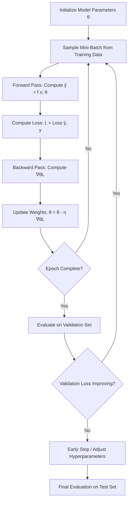

# 1. What is Machine Learning

## 1.1 Definition and Intuition

Machine learning is a paradigm shift in how we build software. In traditional programming, you write explicit rules: **if condition X, then do Y**. You, the programmer, encode all the logic. But for some problems, writing explicit rules is essentially impossible. Consider recognizing handwritten digits — you cannot write `if pixel(12, 15) > 200 and pixel(13, 16) < 50 then digit = 7` because the space of possible variations is astronomically large.

Machine learning flips this around. Instead of writing the rules, you provide **examples** (data) and let the algorithm **discover the rules**. The core idea is beautifully simple:

> A machine learning model is a function $f(x; \theta)$ parameterized by $\theta$, where $\theta$ is learned from data rather than hand-specified.

The word "learned" here means: we adjust $\theta$ iteratively so that $f(x; \theta)$ produces outputs that are close to what we want, as measured on the training data. The model starts with random $\theta$ and slowly improves through an optimization process.

Think of it like learning to ride a bike. Nobody hands you a physics textbook with equations for balance. You get on, wobble, fall, adjust, and gradually your brain "tunes its parameters" to balance. ML works the same way — it tunes $\theta$ until the model performs well.

## 1.2 Types of Machine Learning

Not all ML is the same. The three major paradigms differ in what kind of data they require and what they optimize for:

### Supervised Learning
You have **input-output pairs** $(x_i, y_i)$. The goal is to learn a mapping $f: X \rightarrow Y$ such that $f(x) \approx y$ for unseen inputs. Examples: image classification, speech recognition, machine translation, and — critically for this project — **math formula image to LaTeX conversion**.

### Unsupervised Learning
You only have inputs $x_i$, no labels. The goal is to discover structure in the data: clustering, dimensionality reduction, anomaly detection. Examples: customer segmentation, topic modeling, finding patterns in unlabeled data.

### Reinforcement Learning
An agent interacts with an environment, takes actions, and receives **rewards** (or penalties). The goal is to learn a policy that maximizes cumulative reward. Examples: game-playing agents (AlphaGo), robotics, recommendation systems with long-term engagement.

**TAMER OCR falls squarely into supervised learning.** The input $x$ is an image of a math formula, and the output $y$ is the corresponding LaTeX string. Every training example is a (image, LaTeX) pair.

## 1.3 Why OCR for Math Is a Supervised Learning Problem

Math OCR can be framed precisely as a supervised sequence-to-sequence problem:

- **Input**: An image $x \in \mathbb{R}^{H \times W \times 3}$ (a picture of a formula)
- **Output**: A sequence of LaTeX tokens $y = [y_1, y_2, \ldots, y_T]$

This is supervised because we always have the ground-truth LaTeX for every training image. The CROHME dataset, HME100K, Im2LaTeX, and MathWriting all provide this paired data. Without the LaTeX labels, we could not train the model — there would be no signal to learn from.

This is also a **structured output** problem. The output is not a single class label but a variable-length sequence where the order matters enormously. $\frac{a}{b}$ and $\frac{b}{a}$ have the same tokens but in different order, producing completely different math. This sequential nature is why we need a Transformer **decoder** that generates tokens one at a time.

## 1.4 Training, Validation, and Test Splits

When you train a model, you need to know whether it is actually learning something useful or just memorizing the training data. This is why we split our data:

- **Training set**: The model learns from this. Gradients are computed on this data, and weights are updated.
- **Validation set**: Used during training to monitor performance on unseen data. We use this to tune hyperparameters (learning rate, model size, etc.) and to decide when to stop training (early stopping).
- **Test set**: Used **only once**, after all training and tuning is done, to get an unbiased estimate of how the model will perform in the real world.

**Why not just use training and test?** If you tune hyperparameters based on test set performance, you are implicitly "training on the test set" — the model selection process itself is a form of learning. The validation set acts as a buffer: you can tune on validation as much as you want, and the test set remains pristine for the final evaluation.

In TAMER OCR, the four datasets (CROHME, HME100K, Im2LaTeX, MathWriting) are each split into train/val/test. During training, validation loss and BLEU/exact match are monitored. The final model is evaluated on held-out test sets and on the CROHME competition test sets for benchmarking.

## 1.5 Overfitting and Underfitting

These are the two fundamental failure modes of ML:

**Underfitting** (high bias): The model is too simple to capture the patterns in the data. Training loss is high, validation loss is also high. The model hasn't learned enough. Solution: use a bigger model, train longer, reduce regularization.

**Overfitting** (high variance): The model memorizes the training data instead of learning generalizable patterns. Training loss is low but validation loss is high — there is a **gap** between the two. The model performs well on what it has seen but fails on new data. Solution: more data, regularization (dropout, weight decay), data augmentation, early stopping.

The sweet spot is in the middle — a model complex enough to capture the patterns but not so complex that it memorizes noise. This is one of the central tensions in ML, and it connects directly to the bias-variance tradeoff.

## 1.6 The Model as a Parameterized Function

At its core, every ML model is a function $f(x; \theta)$ where:

- $x$ is the input (e.g., an image tensor)
- $\theta$ (theta) represents all the **learnable parameters** (weights and biases)
- $f(x; \theta)$ produces the output (e.g., a probability distribution over LaTeX tokens)

For TAMER OCR, $\theta$ includes:
- The Swin Transformer v2 encoder weights (patch embedding, self-attention layers, MLP layers, layer norms)
- The Transformer decoder weights (cross-attention, self-attention, MLP layers, embeddings)
- The final projection layer that maps decoder hidden states to vocabulary logits

The total parameter count determines the model's **capacity** — how complex a function it can represent. More parameters generally means more capacity, but also more risk of overfitting and more computational cost.

## 1.7 Loss Functions: Measuring How Wrong the Model Is

A loss function $\mathcal{L}(\hat{y}, y)$ quantifies the discrepancy between the model's prediction $\hat{y}$ and the true label $y$. It is the signal that drives learning — without it, there is no way to know whether the model is improving.

For classification and sequence tasks, the standard loss is **cross-entropy**:

$$\mathcal{L}_{CE} = -\sum_{t=1}^{T} \log P(y_t | y_{<t}, x; \theta)$$

This measures how surprised the model is by the correct next token. If the model assigns high probability to the correct token, the loss is low. If the model assigns low probability to the correct token (it's "surprised"), the loss is high.

In TAMER OCR, the loss is computed token-by-token across the entire sequence, with padding tokens ignored via `ignore_index`. The average loss over all non-padding tokens is backpropagated.

## 1.8 The Optimization Loop

Training a model is an iterative process that repeats these steps thousands or millions of times:

1. **Forward pass**: Feed a batch of inputs through the model to get predictions $\hat{y} = f(x; \theta)$
2. **Compute loss**: Compare predictions to ground truth: $\mathcal{L} = \text{Loss}(\hat{y}, y)$
3. **Backward pass**: Compute gradients $\nabla_\theta \mathcal{L}$ — how much each parameter contributes to the loss
4. **Update weights**: Adjust parameters in the direction that reduces loss: $\theta \leftarrow \theta - \eta \nabla_\theta \mathcal{L}$

This is the core loop of all deep learning training. Everything else — fancy optimizers, learning rate schedules, mixed precision — is an optimization of this fundamental cycle.

## 1.9 Generalization: Training Loss Is Not Enough

A common beginner mistake is celebrating when training loss goes to zero. This almost certainly means **overfitting** — the model has memorized the training set and will fail on new data.

**Generalization** is the ability to perform well on unseen data. It is the entire point of ML. We don't care about performance on training data; we care about performance on data the model has never seen.

The gap between training loss and validation loss is your most important diagnostic:
- Small gap → good generalization
- Large gap → overfitting
- Both losses high → underfitting

Techniques that improve generalization include: more training data, data augmentation, regularization (dropout, weight decay), early stopping, and model architecture choices like residual connections.

## 1.10 Bias-Variance Tradeoff

The bias-variance tradeoff is a formal way to think about the overfitting/underfitting balance:

- **Bias**: Error from overly simplistic assumptions. High bias means the model misses relevant patterns (underfitting).
- **Variance**: Error from sensitivity to small fluctuations in training data. High variance means the model captures noise as if it were signal (overfitting).

$$\text{Total Error} = \text{Bias}^2 + \text{Variance} + \text{Irreducible Noise}$$

As model complexity increases, bias decreases (the model can represent more complex functions) but variance increases (the model becomes more sensitive to the specific training data). The optimal model balances these two sources of error.

In practice, modern deep learning often operates in the "overparameterized" regime where the model has far more parameters than training examples, yet still generalizes well thanks to implicit regularization from SGD, explicit regularization techniques, and the structure of the data.

## 1.11 The ML Training Loop — Mermaid Diagram

This diagram captures the full lifecycle of ML training. Notice how the validation set serves as a gatekeeper — it tells us whether the model is genuinely improving or just memorizing. The test set is only touched at the very end, once.

**Key insight for TAMER OCR**: The training loop is the same whether you are training a simple linear model or a massive Transformer. What changes is the model architecture $f(x; \theta)$ and the scale of computation. But the fundamental principle — optimize parameters to minimize loss on training data while monitoring generalization on validation data — is universal.
