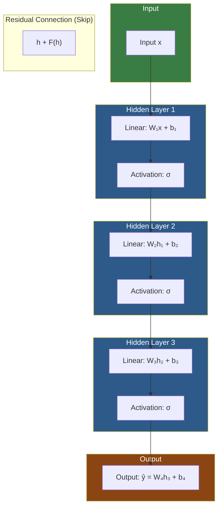
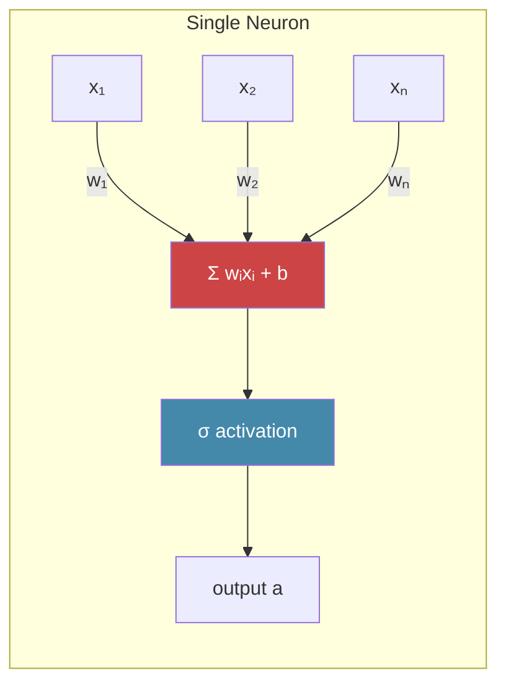

# 2. Deep Learning Fundamentals

## 2.1 From Linear Models to Neural Networks: Why Depth Matters

A linear model makes predictions as $\hat{y} = Wx + b$. It's a hyperplane in input space — it can only learn linear decision boundaries. For simple problems this is fine, but real-world data (especially images) has deeply nonlinear structure.

You could try to make a "wide" linear model by adding many features (e.g., polynomial features), but this leads to combinatorial explosion. Instead, **deep learning** stacks multiple layers of nonlinear transformations:

$$h_1 = \sigma(W_1 x + b_1)$$
$$h_2 = \sigma(W_2 h_1 + b_2)$$
$$\hat{y} = W_3 h_2 + b_3$$

Each layer transforms the representation into a new space where the data becomes more linearly separable. This is the "unfolding" or "disentangling" view of deep learning — depth allows the network to learn a hierarchy of increasingly abstract features.

**Why depth specifically?** Theoretical results show that certain functions require exponentially more parameters to represent with a shallow network than with a deep one. A depth-$L$ network with $n$ neurons per layer can represent functions that would need $O(2^L)$ parameters in a single hidden layer network. Depth is not just helpful — it is **fundamentally more efficient** for representing complex functions.

For TAMER OCR, this principle manifests at two levels:
- The **Swin Transformer encoder** extracts hierarchical visual features from the image through 4 stages of increasing abstraction
- The **Transformer decoder** processes these features through multiple self-attention and cross-attention layers to generate LaTeX tokens

## 2.2 The Neuron: Weighted Sum Plus Activation

The fundamental unit of a neural network is the **artificial neuron**, loosely inspired by biological neurons. It performs two operations:

1. **Weighted sum**: $z = \sum_i w_i x_i + b = w^T x + b$
2. **Activation function**: $a = \sigma(z)$

The weights $w$ determine how much each input matters. The bias $b$ shifts the activation threshold. The activation function $\sigma$ introduces nonlinearity — without it, stacking layers would be equivalent to a single linear transformation (because composing linear functions is still linear).

A single neuron computes a hyperplane decision boundary: it fires when $w^T x + b > 0$. A layer of neurons computes multiple such boundaries in parallel. By stacking layers, the network creates piecewise-linear (or smoothly curved) decision regions of arbitrary complexity.

## 2.3 Common Activation Functions

### ReLU (Rectified Linear Unit)
$$\text{ReLU}(z) = \max(0, z)$$

The workhorse of deep learning. Simple, fast, and empirically effective. Its gradient is either 0 (for negative inputs) or 1 (for positive inputs), which avoids the vanishing gradient problem for positive activations. However, neurons that consistently receive negative inputs "die" — they output zero and never recover because their gradient is zero. This is the **dying ReLU** problem.

### GELU (Gaussian Error Linear Unit)
$$\text{GELU}(z) = z \cdot \Phi(z)$$

where $\Phi(z)$ is the CDF of the standard normal distribution. GELU is a **smooth** approximation to ReLU. Instead of a hard cutoff at zero, it smoothly transitions, weighting the input by how likely it is to be positive under a Gaussian assumption.

GELU is used in **all modern Transformer architectures** — BERT, GPT, ViT, Swin, and our TAMER OCR model. It tends to outperform ReLU in Transformer settings, likely because:
- The smooth gradient around zero prevents dead neurons
- The non-monotonic dip for negative values provides a gating effect (similar to LSTM gates)
- Better gradient flow through deep stacks of layers

### Sigmoid
$$\sigma(z) = \frac{1}{1 + e^{-z}}$$

Maps any input to the range $(0, 1)$. Historically important but largely replaced by ReLU/GELU in hidden layers due to vanishing gradients: the gradient approaches zero for very positive or very negative inputs, causing deep layers to barely update. Still used for binary classification output layers where a probability is needed.

### Tanh
$$\tanh(z) = \frac{e^z - e^{-z}}{e^z + e^{-z}}$$

Maps to $(-1, 1)$. Zero-centered (unlike sigmoid), which helps optimization. Still suffers from vanishing gradients at the extremes. Sometimes used in LSTM/GRU gates.

### Softmax
$$\text{Softmax}(z_i) = \frac{e^{z_i}}{\sum_j e^{z_j}}$$

Converts a vector of logits into a probability distribution. Used at the **output layer** for multi-class classification. In TAMER OCR, softmax is applied to the decoder's output logits to produce a probability distribution over the LaTeX vocabulary at each generation step. **Softmax is never used in hidden layers** — it is specifically an output activation for probabilistic interpretation.

## 2.4 Why GELU Is Used in Transformers

The choice of GELU over ReLU in Transformers deserves special attention because it affects every forward pass in the TAMER model.

GELU's key property is **smooth gating**. For positive inputs, $\Phi(z) \approx 1$, so GELU behaves like the identity (passing the value through). For large negative inputs, $\Phi(z) \approx 0$, so GELU gates them out. For inputs near zero, GELU provides a smooth transition — it doesn't have the sharp discontinuity of ReLU at zero.

This matters in Transformers because:
1. **Attention weights are soft**: Unlike CNNs where features are spatially rigid, Transformers use attention to softly select features. GELU's smooth gating complements this soft selection.
2. **Residual connections**: Transformers rely heavily on residual (skip) connections. GELU's smoother gradients help maintain gradient flow through many residual blocks.
3. **Pre-norm architecture**: Modern Transformers use layer normalization before attention/MLP, which means activations can be near zero. GELU handles this regime better than ReLU's hard cutoff.

The practical difference is modest for a single layer but compounds across 12–24 layers. In the Swin Transformer v2 encoder alone, there are 96 GELU activations (2 per MLP block × 48 blocks), and the decoder adds more. This cumulative effect makes GELU a meaningful design choice.

## 2.5 Layers: Dense/Linear Layers

A **linear layer** (also called dense, fully-connected, or affine layer) is the basic building block:

$$y = xW^T + b$$

where $x \in \mathbb{R}^{1 \times d_{in}}$, $W \in \mathbb{R}^{d_{out} \times d_{in}}$, $b \in \mathbb{R}^{d_{out}}$.

In PyTorch: `nn.Linear(in_features, out_features)`

A linear layer performs a learned linear projection. It can change the dimensionality of the representation (e.g., projecting from 768 to 256 dimensions), rotate the data, and scale it. But it cannot introduce nonlinearity — that is the job of the activation function.

In the Swin Transformer, linear layers appear in:
- **Patch embedding**: Projects raw patch pixels to the embedding dimension
- **QKV projection**: Projects features to query, key, and value for attention
- **Output projection**: Projects attention output back to the model dimension
- **MLP blocks**: Two linear layers with a GELU activation in between

In the decoder, linear layers appear in:
- **Token embedding**: Maps token indices to embedding vectors
- **QKV projections** for both self-attention and cross-attention
- **Output projection**: Maps decoder hidden states to vocabulary logits (this is the largest linear layer — $d_{model} \times |\text{vocab}|$)

## 2.6 Forward Propagation Step by Step

Forward propagation is the process of computing the model's output given an input. Let's trace it through a simple 3-layer network:

1. **Input**: $x \in \mathbb{R}^{d_{in}}$
2. **Layer 1**: $h_1 = \sigma(W_1 x + b_1)$ — project to $d_1$ dimensions, apply activation
3. **Layer 2**: $h_2 = \sigma(W_2 h_1 + b_2)$ — project to $d_2$ dimensions, apply activation
4. **Output**: $\hat{y} = W_3 h_2 + b_3$ — project to $d_{out}$ dimensions (no activation on final layer in regression; softmax for classification)

Each step is a simple matrix multiplication followed by an activation. The "deep" part is just doing this many times. The power comes from the composition of nonlinearities — each layer can warp the representation space in ways that make the next layer's job easier.

In TAMER OCR, a forward pass involves:
1. Swin encoder processes the image → sequence of visual features
2. Decoder receives SOS token + visual features → first token logits
3. (During training) All target tokens are processed in parallel → all token logits at once
4. (During inference) Tokens are generated one at a time → sequential forward passes

## 2.7 Backpropagation: The Chain Rule Across Layers

Backpropagation is how we compute $\frac{\partial \mathcal{L}}{\partial \theta}$ for every parameter $\theta$ in the network. It is literally the **chain rule of calculus** applied systematically through the computational graph.

For a 3-layer network, the gradient of the loss with respect to $W_1$ is:

$$\frac{\partial \mathcal{L}}{\partial W_1} = \frac{\partial \mathcal{L}}{\partial \hat{y}} \cdot \frac{\partial \hat{y}}{\partial h_2} \cdot \frac{\partial h_2}{\partial h_1} \cdot \frac{\partial h_1}{\partial W_1}$$

Each term in this product is a Jacobian matrix. Backpropagation computes these products efficiently by working **backwards** from the loss to the input:

1. Compute $\frac{\partial \mathcal{L}}{\partial \hat{y}}$ (derivative of loss w.r.t. output)
2. Compute $\frac{\partial \mathcal{L}}{\partial h_2} = \frac{\partial \mathcal{L}}{\partial \hat{y}} \cdot \frac{\partial \hat{y}}{\partial h_2}$ (chain through output layer)
3. Compute $\frac{\partial \mathcal{L}}{\partial h_1} = \frac{\partial \mathcal{L}}{\partial h_2} \cdot \frac{\partial h_2}{\partial h_1}$ (chain through hidden layer 2)
4. Compute $\frac{\partial \mathcal{L}}{\partial W_1} = \frac{\partial \mathcal{L}}{\partial h_1} \cdot \frac{\partial h_1}{\partial W_1}$ (chain through hidden layer 1)

The key insight is that each layer only needs two things to compute its gradients: the **upstream gradient** (from the layer above) and its **local computation** (the forward pass values it cached). This makes backpropagation both modular and efficient.

## 2.8 Computational Graphs and Autograd

PyTorch uses **dynamic computational graphs** to implement automatic differentiation. During the forward pass, PyTorch records every operation in a directed acyclic graph (DAG). When you call `.backward()`, it traverses this graph in reverse to compute all gradients.

```python
# PyTorch autograd in action
x = torch.tensor([2.0], requires_grad=True)
y = x ** 2 + 3 * x + 1
y.backward()
print(x.grad)  # dy/dx = 2x + 3 = 2(2) + 3 = 7
```

Key autograd concepts:
- **`requires_grad=True`**: Tells PyTorch to track operations on this tensor
- **`.backward()`**: Computes gradients for all tensors with `requires_grad=True`
- **`.grad`**: Stores the computed gradient after `.backward()`
- **`torch.no_grad()`**: Disables gradient tracking (saves memory, used during evaluation)

The beauty of autograd is that you never need to manually derive gradients. You just write the forward pass as regular Python code, and PyTorch handles the backward pass automatically. This is why we can build arbitrarily complex architectures (like Swin + Transformer decoder) without worrying about gradient derivation.

## 2.9 Why Depth Beats Width for Representational Power

It is a well-established theoretical result that deep networks are exponentially more efficient than wide, shallow networks for certain function classes. Consider the parity function: a deep network of depth $O(\log n)$ can compute parity of $n$ bits, but a shallow network with one hidden layer needs $O(2^n)$ neurons.

For visual recognition, this means:
- A shallow network would need astronomical width to detect all possible combinations of low-level features
- A deep network can compose features hierarchically: edges → motifs → parts → objects

The Swin Transformer v2 in TAMER OCR exploits this hierarchy explicitly through its 4 stages, each doubling the number of channels and halving the spatial resolution. Early stages detect strokes and simple shapes; later stages detect complex mathematical structures like fractions, integrals, and matrices.

## 2.10 Vanishing and Exploding Gradients

When a network is very deep, the gradient must pass through many layers during backpropagation. Each layer multiplies the gradient by its local Jacobian. If these Jacobians have singular values less than 1, the gradient **vanishes** — it shrinks exponentially with depth, and early layers barely update. If the singular values are greater than 1, the gradient **explodes** — it grows exponentially, causing numerical instability.

This is especially problematic with sigmoid and tanh activations, which compress their inputs to bounded ranges and have maximum gradients of 0.25 and 1.0 respectively. After passing through many such layers, the gradient is attenuated by a factor of $(0.25)^L$ for sigmoid — after 10 layers, the gradient is $10^{-6}$ of its original magnitude.

ReLU partially solves this because its gradient is exactly 1 for positive inputs, allowing gradients to flow through without attenuation. But the dying ReLU problem replaces it with a different issue.

## 2.11 Skip Connections / Residual Connections

The breakthrough solution to vanishing gradients is the **residual connection** (He et al., 2016). Instead of learning the transformation directly, the layer learns the **residual** — the difference between input and output:

$$y = F(x) + x$$

where $F(x)$ is the transformation the layer learns. During backpropagation, the gradient flows through two paths: through $F(x)$ (which may vanish) and through the identity shortcut (which has gradient 1). The shortcut guarantees that the gradient always has a direct path to earlier layers, regardless of what $F$ does.

$$\frac{\partial \mathcal{L}}{\partial x} = \frac{\partial \mathcal{L}}{\partial y} \cdot \frac{\partial y}{\partial x} = \frac{\partial \mathcal{L}}{\partial y} \cdot \left(\frac{\partial F}{\partial x} + 1\right)$$

That `+1` is the magic. Even if $\frac{\partial F}{\partial x} \approx 0$, the gradient still flows through the `+1` term.

**In TAMER OCR, residual connections are everywhere:**
- Every Swin Transformer block has a residual connection around both the attention and MLP sub-blocks
- Every Transformer decoder block has residual connections around self-attention, cross-attention, and MLP
- Without these, neither the 48-block Swin encoder nor the deep decoder could train effectively

## 2.12 Parameter Counting: What Determines Model Size

A model's parameter count directly determines its memory usage, computational cost, and representational capacity. For a linear layer `nn.Linear(d_in, d_out)`:

- Weight matrix: $d_{out} \times d_{in}$ parameters
- Bias vector: $d_{out}$ parameters
- Total: $d_{out} \times (d_{in} + 1) \approx d_{out} \times d_{in}$ for large dimensions

For a Transformer block (simplified):
- Self-attention QKV: $3 \times d^2$ (three projections of size $d \times d$)
- Self-attention output: $d^2$
- MLP (two layers): $d \times 4d + 4d \times d = 8d^2$
- LayerNorms: $\approx 4d$ (negligible for large $d$)
- **Total per block**: $\approx 12d^2$

For the Swin Transformer v2-Small ($d = 96, 192, 384, 768$ across 4 stages):
- Stage 1: 2 blocks × $12 \times 96^2 \approx 0.2M$
- Stage 2: 2 blocks × $12 \times 192^2 \approx 0.9M$
- Stage 3: 18 blocks × $12 \times 384^2 \approx 31.7M$
- Stage 4: 2 blocks × $12 \times 768^2 \approx 14.2M$
- **Total encoder**: ~50M parameters

The decoder adds another ~30–50M depending on vocabulary size and number of layers. The output projection ($d_{model} \times |\text{vocab}|$) is often the single largest linear layer because the vocabulary can be 5,000–15,000 tokens.

## 2.13 Multi-Layer Neural Network — Mermaid Diagram





The first diagram shows the overall flow of data through a multi-layer network. Each layer applies a linear transformation followed by a non-linear activation. The second diagram zooms into a single neuron, showing the weighted sum and activation in detail.

**For TAMER OCR**, remember that the Swin encoder and Transformer decoder are both stacks of such layers — just with attention mechanisms replacing simple linear projections. The same principles (nonlinear activation, residual connections, gradient flow) apply throughout.
